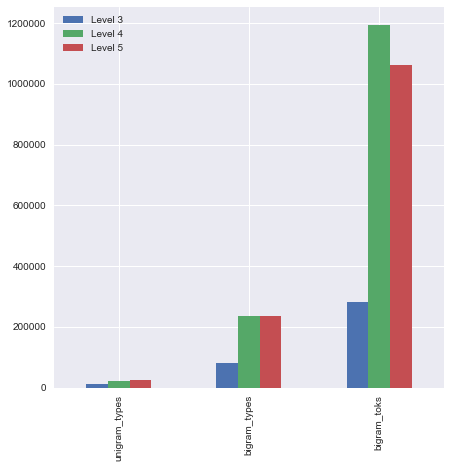
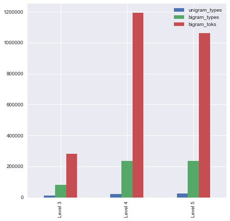
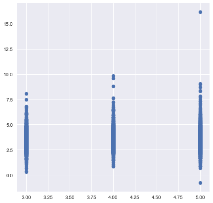
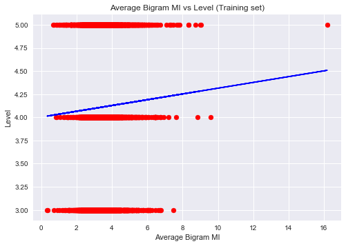
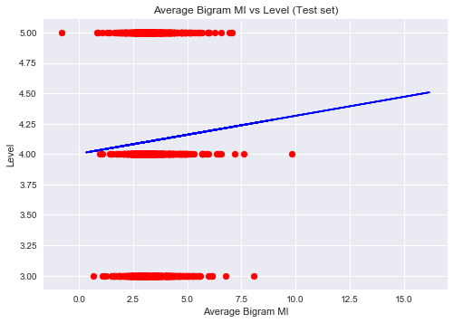
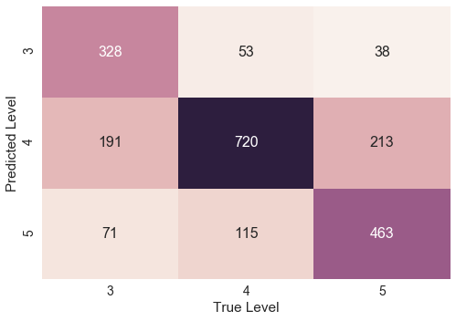

# Visualizations of data from project_code_FINAL.ipynb

### Table of contents ###

1.  [Initial setup](#1.-Initial-setup): importing necessary modules and pickles
2.  [Reminder of overall breakdown](#2.-Reminder-of-overall-breakdown): key overall stats from corpus
3.  ['Top 20' lists](#3.-'Top-20'-lists): predicting level_id in two ways
3.  [Machine Learning](#4.-Machine-Learning): predicting level_id in two ways
4.  [Plotting data](#5.-Plotting-data): creating visualizations of data from previous section


### 1. Initial setup ###


```python
import pandas as pd
import numpy as np
import matplotlib.pyplot as plt
import sklearn
import seaborn as sns
import pickle

#return every shell
from IPython.core.interactiveshell import InteractiveShell
InteractiveShell.ast_node_interactivity = "all"

cor_dir = "/Users/Benjamin's/Documents/Data_Science/bnaismith_LING2340_project/"

bigram_df = pd.read_pickle(cor_dir + 'bigram_df.pkl')
combo_df = pd.read_pickle(cor_dir + 'combo_df.pkl')
levels_df = pd.read_pickle(cor_dir + 'levels_df.pkl')

with open('MI_dict.pkl', 'rb') as handle:
    MI_dict = pickle.load(handle)
```

### 2. Reminder of overall breakdown


```python
levels_df
```


<div>
<style>
    .dataframe thead tr:only-child th {
        text-align: right;
    }

    .dataframe thead th {
        text-align: left;
    }

    .dataframe tbody tr th {
        vertical-align: top;
    }
</style>
<table border="1" class="dataframe">
  <thead>
    <tr style="text-align: right;">
      <th></th>
      <th>unigram_toks</th>
      <th>unigram_types</th>
      <th>bigram_toks</th>
      <th>bigram_types</th>
      <th>texts</th>
    </tr>
  </thead>
  <tbody>
    <tr>
      <th>Level 3</th>
      <td>282844</td>
      <td>11816</td>
      <td>282843</td>
      <td>81209</td>
      <td>2698</td>
    </tr>
    <tr>
      <th>Level 4</th>
      <td>1193172</td>
      <td>23231</td>
      <td>1193171</td>
      <td>236467</td>
      <td>4509</td>
    </tr>
    <tr>
      <th>Level 5</th>
      <td>1060753</td>
      <td>23667</td>
      <td>1060752</td>
      <td>236637</td>
      <td>3749</td>
    </tr>
    <tr>
      <th>Total</th>
      <td>2549012</td>
      <td>39016</td>
      <td>2549011</td>
      <td>430738</td>
      <td>10956</td>
    </tr>
  </tbody>
</table>
</div>


```python
#bar graph of level data

plot = levels_df[['unigram_types','bigram_types','bigram_toks']].iloc[:3,:].T.plot(kind='bar', figsize=(7,7))
plot.figure

plot = levels_df[['unigram_types','bigram_types','bigram_toks']].iloc[:3,:].plot(kind='bar', figsize=(7,7))
plot.figure
```








### 3. 'Top 20' lists

Different 'Top 20' lists to get a feel for types of results each stat produces


```python
#Starting with class tokens

top_bigram_toks = bigram_df.sort_values('tokens', ascending = False).reset_index(drop=True)
top_bigram_toks.index += 1 #lists look better starting at 1
top_bigram_toks.head(20)

#not very helpful - all punctuation and stop words
```


<div>
<style>
    .dataframe thead tr:only-child th {
        text-align: right;
    }

    .dataframe thead th {
        text-align: left;
    }

    .dataframe tbody tr th {
        vertical-align: top;
    }
</style>
<table border="1" class="dataframe">
  <thead>
    <tr style="text-align: right;">
      <th></th>
      <th>bigram</th>
      <th>tokens</th>
      <th>MI</th>
      <th>per_million</th>
      <th>lv3_norm_toks</th>
      <th>lv4_norm_toks</th>
      <th>lv5_norm_toks</th>
      <th>lv3_rel_%</th>
      <th>lv4_rel_%</th>
      <th>lv5_rel_%</th>
      <th>lv3_per_M</th>
      <th>lv4_per_M</th>
      <th>lv5_per_M</th>
    </tr>
  </thead>
  <tbody>
    <tr>
      <th>1</th>
      <td>[in, the]</td>
      <td>11172</td>
      <td>2.38</td>
      <td>4382.88</td>
      <td>2315</td>
      <td>3654</td>
      <td>5153</td>
      <td>20.82%</td>
      <td>32.86%</td>
      <td>46.33%</td>
      <td>908.20</td>
      <td>1433.50</td>
      <td>2021.57</td>
    </tr>
    <tr>
      <th>2</th>
      <td>[., the]</td>
      <td>9865</td>
      <td>0.77</td>
      <td>3870.13</td>
      <td>2103</td>
      <td>3970</td>
      <td>3690</td>
      <td>21.57%</td>
      <td>40.71%</td>
      <td>37.85%</td>
      <td>825.03</td>
      <td>1557.47</td>
      <td>1447.62</td>
    </tr>
    <tr>
      <th>3</th>
      <td>[,, and]</td>
      <td>9818</td>
      <td>1.71</td>
      <td>3851.69</td>
      <td>1969</td>
      <td>4295</td>
      <td>3545</td>
      <td>20.07%</td>
      <td>43.79%</td>
      <td>36.14%</td>
      <td>772.46</td>
      <td>1684.97</td>
      <td>1390.74</td>
    </tr>
    <tr>
      <th>4</th>
      <td>[of, the]</td>
      <td>9054</td>
      <td>2.03</td>
      <td>3551.97</td>
      <td>1675</td>
      <td>3146</td>
      <td>4206</td>
      <td>18.55%</td>
      <td>34.86%</td>
      <td>46.59%</td>
      <td>657.12</td>
      <td>1234.20</td>
      <td>1650.05</td>
    </tr>
    <tr>
      <th>5</th>
      <td>[., in]</td>
      <td>8602</td>
      <td>1.68</td>
      <td>3374.64</td>
      <td>1656</td>
      <td>3325</td>
      <td>3619</td>
      <td>19.27%</td>
      <td>38.67%</td>
      <td>42.09%</td>
      <td>649.66</td>
      <td>1304.43</td>
      <td>1419.77</td>
    </tr>
    <tr>
      <th>6</th>
      <td>[,, i]</td>
      <td>8278</td>
      <td>2.40</td>
      <td>3247.53</td>
      <td>2193</td>
      <td>3222</td>
      <td>2799</td>
      <td>26.70%</td>
      <td>39.23%</td>
      <td>34.08%</td>
      <td>860.33</td>
      <td>1264.02</td>
      <td>1098.07</td>
    </tr>
    <tr>
      <th>7</th>
      <td>[,, the]</td>
      <td>8201</td>
      <td>0.64</td>
      <td>3217.33</td>
      <td>1529</td>
      <td>2854</td>
      <td>3810</td>
      <td>18.66%</td>
      <td>34.83%</td>
      <td>46.49%</td>
      <td>599.84</td>
      <td>1119.65</td>
      <td>1494.70</td>
    </tr>
    <tr>
      <th>8</th>
      <td>[., i]</td>
      <td>7442</td>
      <td>2.11</td>
      <td>2919.56</td>
      <td>2185</td>
      <td>2786</td>
      <td>2271</td>
      <td>30.19%</td>
      <td>38.50%</td>
      <td>31.39%</td>
      <td>857.20</td>
      <td>1092.97</td>
      <td>890.93</td>
    </tr>
    <tr>
      <th>9</th>
      <td>[it, is]</td>
      <td>6772</td>
      <td>4.19</td>
      <td>2656.72</td>
      <td>1395</td>
      <td>2548</td>
      <td>2798</td>
      <td>20.69%</td>
      <td>37.80%</td>
      <td>41.51%</td>
      <td>547.27</td>
      <td>999.60</td>
      <td>1097.68</td>
    </tr>
    <tr>
      <th>10</th>
      <td>[., it]</td>
      <td>5154</td>
      <td>2.11</td>
      <td>2021.96</td>
      <td>1109</td>
      <td>2100</td>
      <td>1933</td>
      <td>21.58%</td>
      <td>40.86%</td>
      <td>37.60%</td>
      <td>435.07</td>
      <td>823.85</td>
      <td>758.33</td>
    </tr>
    <tr>
      <th>11</th>
      <td>[there, are]</td>
      <td>5083</td>
      <td>5.99</td>
      <td>1994.11</td>
      <td>1193</td>
      <td>2092</td>
      <td>1770</td>
      <td>23.60%</td>
      <td>41.39%</td>
      <td>35.01%</td>
      <td>468.02</td>
      <td>820.71</td>
      <td>694.39</td>
    </tr>
    <tr>
      <th>12</th>
      <td>[., for]</td>
      <td>4718</td>
      <td>1.87</td>
      <td>1850.91</td>
      <td>1042</td>
      <td>2014</td>
      <td>1662</td>
      <td>22.10%</td>
      <td>42.70%</td>
      <td>35.22%</td>
      <td>408.79</td>
      <td>790.11</td>
      <td>652.02</td>
    </tr>
    <tr>
      <th>13</th>
      <td>[,, you]</td>
      <td>4668</td>
      <td>2.01</td>
      <td>1831.30</td>
      <td>1127</td>
      <td>2256</td>
      <td>1283</td>
      <td>24.15%</td>
      <td>48.35%</td>
      <td>27.50%</td>
      <td>442.13</td>
      <td>885.05</td>
      <td>503.33</td>
    </tr>
    <tr>
      <th>14</th>
      <td>[to, the]</td>
      <td>4573</td>
      <td>0.60</td>
      <td>1794.03</td>
      <td>868</td>
      <td>1624</td>
      <td>2070</td>
      <td>19.03%</td>
      <td>35.60%</td>
      <td>45.37%</td>
      <td>340.52</td>
      <td>637.11</td>
      <td>812.08</td>
    </tr>
    <tr>
      <th>15</th>
      <td>[is, a]</td>
      <td>4439</td>
      <td>2.48</td>
      <td>1741.46</td>
      <td>1114</td>
      <td>1619</td>
      <td>1678</td>
      <td>25.25%</td>
      <td>36.71%</td>
      <td>38.05%</td>
      <td>437.03</td>
      <td>635.15</td>
      <td>658.29</td>
    </tr>
    <tr>
      <th>16</th>
      <td>[on, the]</td>
      <td>4286</td>
      <td>3.17</td>
      <td>1681.44</td>
      <td>948</td>
      <td>1401</td>
      <td>1932</td>
      <td>22.16%</td>
      <td>32.72%</td>
      <td>45.12%</td>
      <td>371.91</td>
      <td>549.62</td>
      <td>757.94</td>
    </tr>
    <tr>
      <th>17</th>
      <td>[,, it]</td>
      <td>4258</td>
      <td>1.97</td>
      <td>1670.45</td>
      <td>821</td>
      <td>1665</td>
      <td>1770</td>
      <td>19.30%</td>
      <td>39.11%</td>
      <td>41.59%</td>
      <td>322.09</td>
      <td>653.19</td>
      <td>694.39</td>
    </tr>
    <tr>
      <th>18</th>
      <td>[a, lot]</td>
      <td>4192</td>
      <td>5.71</td>
      <td>1644.56</td>
      <td>895</td>
      <td>1969</td>
      <td>1321</td>
      <td>21.39%</td>
      <td>47.04%</td>
      <td>31.57%</td>
      <td>351.12</td>
      <td>772.46</td>
      <td>518.24</td>
    </tr>
    <tr>
      <th>19</th>
      <td>[is, the]</td>
      <td>4006</td>
      <td>1.16</td>
      <td>1571.59</td>
      <td>789</td>
      <td>1605</td>
      <td>1574</td>
      <td>19.89%</td>
      <td>40.44%</td>
      <td>39.67%</td>
      <td>309.53</td>
      <td>629.66</td>
      <td>617.49</td>
    </tr>
    <tr>
      <th>20</th>
      <td>[,, they]</td>
      <td>3793</td>
      <td>2.14</td>
      <td>1488.03</td>
      <td>708</td>
      <td>1656</td>
      <td>1426</td>
      <td>18.68%</td>
      <td>43.69%</td>
      <td>37.63%</td>
      <td>277.75</td>
      <td>649.66</td>
      <td>559.43</td>
    </tr>
  </tbody>
</table>
</div>


```python
#Then the (presumably) more predictive MI

top_bigram_MI = bigram_df.sort_values('MI', ascending = False).reset_index(drop=True)
top_bigram_MI.index += 1
top_bigram_MI[top_bigram_MI['tokens'] >= 30].head(20) #set min number to get rid of random names and rarities
```


<div>
<style>
    .dataframe thead tr:only-child th {
        text-align: right;
    }

    .dataframe thead th {
        text-align: left;
    }

    .dataframe tbody tr th {
        vertical-align: top;
    }
</style>
<table border="1" class="dataframe">
  <thead>
    <tr style="text-align: right;">
      <th></th>
      <th>bigram</th>
      <th>tokens</th>
      <th>MI</th>
      <th>per_million</th>
      <th>lv3_norm_toks</th>
      <th>lv4_norm_toks</th>
      <th>lv5_norm_toks</th>
      <th>lv3_rel_%</th>
      <th>lv4_rel_%</th>
      <th>lv5_rel_%</th>
      <th>lv3_per_M</th>
      <th>lv4_per_M</th>
      <th>lv5_per_M</th>
    </tr>
  </thead>
  <tbody>
    <tr>
      <th>4949</th>
      <td>[los, angeles]</td>
      <td>34</td>
      <td>15.95</td>
      <td>13.34</td>
      <td>5</td>
      <td>7</td>
      <td>20</td>
      <td>17.53%</td>
      <td>21.59%</td>
      <td>60.88%</td>
      <td>1.96</td>
      <td>2.75</td>
      <td>7.85</td>
    </tr>
    <tr>
      <th>6097</th>
      <td>[hong, kong]</td>
      <td>50</td>
      <td>15.36</td>
      <td>19.62</td>
      <td>10</td>
      <td>38</td>
      <td>1</td>
      <td>20.71%</td>
      <td>76.18%</td>
      <td>3.11%</td>
      <td>3.92</td>
      <td>14.91</td>
      <td>0.39</td>
    </tr>
    <tr>
      <th>6485</th>
      <td>[undergrad, grill]</td>
      <td>45</td>
      <td>15.19</td>
      <td>17.65</td>
      <td>3</td>
      <td>41</td>
      <td>0</td>
      <td>8.71%</td>
      <td>92.18%</td>
      <td>-0.89%</td>
      <td>1.18</td>
      <td>16.08</td>
      <td>0.00</td>
    </tr>
    <tr>
      <th>6987</th>
      <td>[niagara, falls]</td>
      <td>37</td>
      <td>15.00</td>
      <td>14.52</td>
      <td>5</td>
      <td>32</td>
      <td>0</td>
      <td>14.11%</td>
      <td>86.77%</td>
      <td>-0.89%</td>
      <td>1.96</td>
      <td>12.55</td>
      <td>0.00</td>
    </tr>
    <tr>
      <th>6988</th>
      <td>[el, nino]</td>
      <td>60</td>
      <td>15.00</td>
      <td>23.54</td>
      <td>5</td>
      <td>-4</td>
      <td>59</td>
      <td>8.71%</td>
      <td>-7.82%</td>
      <td>99.11%</td>
      <td>1.96</td>
      <td>-1.57</td>
      <td>23.15</td>
    </tr>
    <tr>
      <th>7072</th>
      <td>[san, francisco]</td>
      <td>45</td>
      <td>14.96</td>
      <td>17.65</td>
      <td>3</td>
      <td>24</td>
      <td>16</td>
      <td>8.71%</td>
      <td>54.40%</td>
      <td>36.89%</td>
      <td>1.18</td>
      <td>9.42</td>
      <td>6.28</td>
    </tr>
    <tr>
      <th>7437</th>
      <td>[carbon, dioxide]</td>
      <td>61</td>
      <td>14.82</td>
      <td>23.93</td>
      <td>7</td>
      <td>5</td>
      <td>46</td>
      <td>12.10%</td>
      <td>9.13%</td>
      <td>78.78%</td>
      <td>2.75</td>
      <td>1.96</td>
      <td>18.05</td>
    </tr>
    <tr>
      <th>9741</th>
      <td>[southwestern, pennsylvania]</td>
      <td>33</td>
      <td>14.04</td>
      <td>12.95</td>
      <td>15</td>
      <td>-1</td>
      <td>0</td>
      <td>108.71%</td>
      <td>-7.82%</td>
      <td>-0.89%</td>
      <td>5.88</td>
      <td>-0.39</td>
      <td>0.00</td>
    </tr>
    <tr>
      <th>9747</th>
      <td>[frying, pan]</td>
      <td>49</td>
      <td>14.04</td>
      <td>19.22</td>
      <td>52</td>
      <td>-2</td>
      <td>0</td>
      <td>106.67%</td>
      <td>-5.78%</td>
      <td>-0.89%</td>
      <td>20.40</td>
      <td>-0.78</td>
      <td>0.00</td>
    </tr>
    <tr>
      <th>10794</th>
      <td>[alarm, clock]</td>
      <td>47</td>
      <td>13.73</td>
      <td>18.44</td>
      <td>41</td>
      <td>-1</td>
      <td>7</td>
      <td>87.43%</td>
      <td>-3.57%</td>
      <td>16.14%</td>
      <td>16.08</td>
      <td>-0.39</td>
      <td>2.75</td>
    </tr>
    <tr>
      <th>11627</th>
      <td>[scrambled, eggs]</td>
      <td>60</td>
      <td>13.53</td>
      <td>23.54</td>
      <td>65</td>
      <td>-4</td>
      <td>0</td>
      <td>108.71%</td>
      <td>-7.82%</td>
      <td>-0.89%</td>
      <td>25.50</td>
      <td>-1.57</td>
      <td>0.00</td>
    </tr>
    <tr>
      <th>12110</th>
      <td>[gm, crops]</td>
      <td>92</td>
      <td>13.41</td>
      <td>36.09</td>
      <td>8</td>
      <td>-7</td>
      <td>91</td>
      <td>8.71%</td>
      <td>-7.82%</td>
      <td>99.11%</td>
      <td>3.14</td>
      <td>-2.75</td>
      <td>35.70</td>
    </tr>
    <tr>
      <th>12447</th>
      <td>[falling, asleep]</td>
      <td>30</td>
      <td>13.34</td>
      <td>11.77</td>
      <td>2</td>
      <td>16</td>
      <td>10</td>
      <td>8.71%</td>
      <td>55.51%</td>
      <td>35.78%</td>
      <td>0.78</td>
      <td>6.28</td>
      <td>3.92</td>
    </tr>
    <tr>
      <th>12983</th>
      <td>[jim, springer]</td>
      <td>36</td>
      <td>13.22</td>
      <td>14.12</td>
      <td>3</td>
      <td>33</td>
      <td>0</td>
      <td>8.71%</td>
      <td>92.18%</td>
      <td>-0.89%</td>
      <td>1.18</td>
      <td>12.95</td>
      <td>0.00</td>
    </tr>
    <tr>
      <th>13057</th>
      <td>[ice, cream]</td>
      <td>50</td>
      <td>13.20</td>
      <td>19.62</td>
      <td>34</td>
      <td>14</td>
      <td>1</td>
      <td>68.71%</td>
      <td>28.18%</td>
      <td>3.11%</td>
      <td>13.34</td>
      <td>5.49</td>
      <td>0.39</td>
    </tr>
    <tr>
      <th>13080</th>
      <td>[jim, lewis]</td>
      <td>36</td>
      <td>13.20</td>
      <td>14.12</td>
      <td>3</td>
      <td>33</td>
      <td>0</td>
      <td>8.71%</td>
      <td>92.18%</td>
      <td>-0.89%</td>
      <td>1.18</td>
      <td>12.95</td>
      <td>0.00</td>
    </tr>
    <tr>
      <th>13260</th>
      <td>[traffic, jam]</td>
      <td>36</td>
      <td>13.17</td>
      <td>14.12</td>
      <td>10</td>
      <td>15</td>
      <td>10</td>
      <td>28.15%</td>
      <td>42.18%</td>
      <td>29.67%</td>
      <td>3.92</td>
      <td>5.88</td>
      <td>3.92</td>
    </tr>
    <tr>
      <th>13423</th>
      <td>[mp3, file]</td>
      <td>38</td>
      <td>13.12</td>
      <td>14.91</td>
      <td>3</td>
      <td>-2</td>
      <td>37</td>
      <td>8.71%</td>
      <td>-7.82%</td>
      <td>99.11%</td>
      <td>1.18</td>
      <td>-0.78</td>
      <td>14.52</td>
    </tr>
    <tr>
      <th>14123</th>
      <td>[credit, cards]</td>
      <td>66</td>
      <td>12.99</td>
      <td>25.89</td>
      <td>5</td>
      <td>0</td>
      <td>59</td>
      <td>8.71%</td>
      <td>1.27%</td>
      <td>90.02%</td>
      <td>1.96</td>
      <td>0.00</td>
      <td>23.15</td>
    </tr>
    <tr>
      <th>14423</th>
      <td>[opposing, argument]</td>
      <td>32</td>
      <td>12.92</td>
      <td>12.55</td>
      <td>2</td>
      <td>-2</td>
      <td>31</td>
      <td>8.71%</td>
      <td>-7.82%</td>
      <td>99.11%</td>
      <td>0.78</td>
      <td>-0.78</td>
      <td>12.16</td>
    </tr>
  </tbody>
</table>
</div>


```python
#but a lot of compound nouns, so maybe a 'medium' MI of 10 will have more collocations

top_bigram_MI.loc[(top_bigram_MI['tokens'] >= 30) & (top_bigram_MI['MI'] <= 10), :].head(20)

#seems like this is a useful approach but 'best' MI range needs exploring with human judgments
```


<div>
<style>
    .dataframe thead tr:only-child th {
        text-align: right;
    }

    .dataframe thead th {
        text-align: left;
    }

    .dataframe tbody tr th {
        vertical-align: top;
    }
</style>
<table border="1" class="dataframe">
  <thead>
    <tr style="text-align: right;">
      <th></th>
      <th>bigram</th>
      <th>tokens</th>
      <th>MI</th>
      <th>per_million</th>
      <th>lv3_norm_toks</th>
      <th>lv4_norm_toks</th>
      <th>lv5_norm_toks</th>
      <th>lv3_rel_%</th>
      <th>lv4_rel_%</th>
      <th>lv5_rel_%</th>
      <th>lv3_per_M</th>
      <th>lv4_per_M</th>
      <th>lv5_per_M</th>
    </tr>
  </thead>
  <tbody>
    <tr>
      <th>36882</th>
      <td>[unemployment, rate]</td>
      <td>36</td>
      <td>9.99</td>
      <td>14.12</td>
      <td>3</td>
      <td>21</td>
      <td>11</td>
      <td>8.71%</td>
      <td>58.84%</td>
      <td>32.45%</td>
      <td>1.18</td>
      <td>8.24</td>
      <td>4.32</td>
    </tr>
    <tr>
      <th>37302</th>
      <td>[south, korea]</td>
      <td>196</td>
      <td>9.95</td>
      <td>76.89</td>
      <td>20</td>
      <td>28</td>
      <td>145</td>
      <td>10.76%</td>
      <td>14.74%</td>
      <td>74.50%</td>
      <td>7.85</td>
      <td>10.98</td>
      <td>56.88</td>
    </tr>
    <tr>
      <th>38085</th>
      <td>[physical, activity]</td>
      <td>93</td>
      <td>9.90</td>
      <td>36.48</td>
      <td>10</td>
      <td>54</td>
      <td>28</td>
      <td>10.86%</td>
      <td>58.84%</td>
      <td>30.30%</td>
      <td>3.92</td>
      <td>21.18</td>
      <td>10.98</td>
    </tr>
    <tr>
      <th>38232</th>
      <td>[tea, bowl]</td>
      <td>52</td>
      <td>9.88</td>
      <td>20.40</td>
      <td>4</td>
      <td>47</td>
      <td>0</td>
      <td>8.71%</td>
      <td>92.18%</td>
      <td>-0.89%</td>
      <td>1.57</td>
      <td>18.44</td>
      <td>0.00</td>
    </tr>
    <tr>
      <th>38265</th>
      <td>[pay, attention]</td>
      <td>117</td>
      <td>9.88</td>
      <td>45.90</td>
      <td>23</td>
      <td>55</td>
      <td>37</td>
      <td>19.82%</td>
      <td>47.73%</td>
      <td>32.45%</td>
      <td>9.02</td>
      <td>21.58</td>
      <td>14.52</td>
    </tr>
    <tr>
      <th>38279</th>
      <td>[eating, habits]</td>
      <td>147</td>
      <td>9.88</td>
      <td>57.67</td>
      <td>12</td>
      <td>97</td>
      <td>36</td>
      <td>8.71%</td>
      <td>66.33%</td>
      <td>24.96%</td>
      <td>4.71</td>
      <td>38.05</td>
      <td>14.12</td>
    </tr>
    <tr>
      <th>38436</th>
      <td>[years, ago]</td>
      <td>420</td>
      <td>9.86</td>
      <td>164.77</td>
      <td>72</td>
      <td>123</td>
      <td>222</td>
      <td>17.32%</td>
      <td>29.50%</td>
      <td>53.18%</td>
      <td>28.25</td>
      <td>48.25</td>
      <td>87.09</td>
    </tr>
    <tr>
      <th>38914</th>
      <td>[public, transportation]</td>
      <td>201</td>
      <td>9.82</td>
      <td>78.85</td>
      <td>42</td>
      <td>49</td>
      <td>109</td>
      <td>21.15%</td>
      <td>24.52%</td>
      <td>54.34%</td>
      <td>16.48</td>
      <td>19.22</td>
      <td>42.76</td>
    </tr>
    <tr>
      <th>39100</th>
      <td>[wake, up]</td>
      <td>113</td>
      <td>9.79</td>
      <td>44.33</td>
      <td>35</td>
      <td>44</td>
      <td>32</td>
      <td>31.72%</td>
      <td>39.08%</td>
      <td>29.20%</td>
      <td>13.73</td>
      <td>17.26</td>
      <td>12.55</td>
    </tr>
    <tr>
      <th>39145</th>
      <td>[chinese, calendar]</td>
      <td>37</td>
      <td>9.79</td>
      <td>14.52</td>
      <td>3</td>
      <td>34</td>
      <td>0</td>
      <td>8.71%</td>
      <td>92.18%</td>
      <td>-0.89%</td>
      <td>1.18</td>
      <td>13.34</td>
      <td>0.00</td>
    </tr>
    <tr>
      <th>39334</th>
      <td>[hang, out]</td>
      <td>69</td>
      <td>9.77</td>
      <td>27.07</td>
      <td>14</td>
      <td>39</td>
      <td>15</td>
      <td>20.30%</td>
      <td>57.40%</td>
      <td>22.30%</td>
      <td>5.49</td>
      <td>15.30</td>
      <td>5.88</td>
    </tr>
    <tr>
      <th>39459</th>
      <td>[college, entrance]</td>
      <td>30</td>
      <td>9.76</td>
      <td>11.77</td>
      <td>2</td>
      <td>20</td>
      <td>6</td>
      <td>8.71%</td>
      <td>68.84%</td>
      <td>22.45%</td>
      <td>0.78</td>
      <td>7.85</td>
      <td>2.35</td>
    </tr>
    <tr>
      <th>39524</th>
      <td>[woke, up]</td>
      <td>39</td>
      <td>9.75</td>
      <td>15.30</td>
      <td>11</td>
      <td>11</td>
      <td>15</td>
      <td>29.22%</td>
      <td>30.64%</td>
      <td>40.14%</td>
      <td>4.32</td>
      <td>4.32</td>
      <td>5.88</td>
    </tr>
    <tr>
      <th>40163</th>
      <td>[figure, out]</td>
      <td>100</td>
      <td>9.71</td>
      <td>39.23</td>
      <td>11</td>
      <td>49</td>
      <td>39</td>
      <td>11.71%</td>
      <td>49.18%</td>
      <td>39.11%</td>
      <td>4.32</td>
      <td>19.22</td>
      <td>15.30</td>
    </tr>
    <tr>
      <th>40166</th>
      <td>[*, &amp;]</td>
      <td>74</td>
      <td>9.71</td>
      <td>29.03</td>
      <td>6</td>
      <td>68</td>
      <td>0</td>
      <td>8.71%</td>
      <td>92.18%</td>
      <td>-0.89%</td>
      <td>2.35</td>
      <td>26.68</td>
      <td>0.00</td>
    </tr>
    <tr>
      <th>40274</th>
      <td>[sex, marriage]</td>
      <td>33</td>
      <td>9.70</td>
      <td>12.95</td>
      <td>2</td>
      <td>-2</td>
      <td>32</td>
      <td>8.71%</td>
      <td>-7.82%</td>
      <td>99.11%</td>
      <td>0.78</td>
      <td>-0.78</td>
      <td>12.55</td>
    </tr>
    <tr>
      <th>40547</th>
      <td>[10, percent]</td>
      <td>31</td>
      <td>9.67</td>
      <td>12.16</td>
      <td>23</td>
      <td>4</td>
      <td>2</td>
      <td>76.45%</td>
      <td>14.76%</td>
      <td>8.79%</td>
      <td>9.02</td>
      <td>1.57</td>
      <td>0.78</td>
    </tr>
    <tr>
      <th>40634</th>
      <td>[20, minutes]</td>
      <td>32</td>
      <td>9.67</td>
      <td>12.55</td>
      <td>7</td>
      <td>8</td>
      <td>15</td>
      <td>24.33%</td>
      <td>26.55%</td>
      <td>49.11%</td>
      <td>2.75</td>
      <td>3.14</td>
      <td>5.88</td>
    </tr>
    <tr>
      <th>40662</th>
      <td>[taking, notes]</td>
      <td>30</td>
      <td>9.66</td>
      <td>11.77</td>
      <td>19</td>
      <td>8</td>
      <td>1</td>
      <td>65.37%</td>
      <td>28.84%</td>
      <td>5.78%</td>
      <td>7.45</td>
      <td>3.14</td>
      <td>0.39</td>
    </tr>
    <tr>
      <th>40828</th>
      <td>[watching, tv]</td>
      <td>116</td>
      <td>9.64</td>
      <td>45.51</td>
      <td>21</td>
      <td>51</td>
      <td>42</td>
      <td>18.19%</td>
      <td>44.76%</td>
      <td>37.05%</td>
      <td>8.24</td>
      <td>20.01</td>
      <td>16.48</td>
    </tr>
  </tbody>
</table>
</div>


```python
#The most frequent (normalized) tokens at each level

top_bigram_level3 = bigram_df.sort_values('lv3_norm_toks', ascending = False).reset_index(drop=True)
top_bigram_level3.index += 1
top_bigram_level3.head(10)

top_bigram_level4 = bigram_df.sort_values('lv4_norm_toks', ascending = False).reset_index(drop=True)
top_bigram_level4.index += 1
top_bigram_level4.head(10)

top_bigram_level5 = bigram_df.sort_values('lv5_norm_toks', ascending = False).reset_index(drop=True)
top_bigram_level5.index += 1
top_bigram_level5.head(10)
```


<div>
<style>
    .dataframe thead tr:only-child th {
        text-align: right;
    }

    .dataframe thead th {
        text-align: left;
    }

    .dataframe tbody tr th {
        vertical-align: top;
    }
</style>
<table border="1" class="dataframe">
  <thead>
    <tr style="text-align: right;">
      <th></th>
      <th>bigram</th>
      <th>tokens</th>
      <th>MI</th>
      <th>per_million</th>
      <th>lv3_norm_toks</th>
      <th>lv4_norm_toks</th>
      <th>lv5_norm_toks</th>
      <th>lv3_rel_%</th>
      <th>lv4_rel_%</th>
      <th>lv5_rel_%</th>
      <th>lv3_per_M</th>
      <th>lv4_per_M</th>
      <th>lv5_per_M</th>
    </tr>
  </thead>
  <tbody>
    <tr>
      <th>1</th>
      <td>[in, the]</td>
      <td>11172</td>
      <td>2.38</td>
      <td>4382.88</td>
      <td>2315</td>
      <td>3654</td>
      <td>5153</td>
      <td>20.82%</td>
      <td>32.86%</td>
      <td>46.33%</td>
      <td>908.20</td>
      <td>1433.50</td>
      <td>2021.57</td>
    </tr>
    <tr>
      <th>2</th>
      <td>[,, i]</td>
      <td>8278</td>
      <td>2.40</td>
      <td>3247.53</td>
      <td>2193</td>
      <td>3222</td>
      <td>2799</td>
      <td>26.70%</td>
      <td>39.23%</td>
      <td>34.08%</td>
      <td>860.33</td>
      <td>1264.02</td>
      <td>1098.07</td>
    </tr>
    <tr>
      <th>3</th>
      <td>[., i]</td>
      <td>7442</td>
      <td>2.11</td>
      <td>2919.56</td>
      <td>2185</td>
      <td>2786</td>
      <td>2271</td>
      <td>30.19%</td>
      <td>38.50%</td>
      <td>31.39%</td>
      <td>857.20</td>
      <td>1092.97</td>
      <td>890.93</td>
    </tr>
    <tr>
      <th>4</th>
      <td>[., the]</td>
      <td>9865</td>
      <td>0.77</td>
      <td>3870.13</td>
      <td>2103</td>
      <td>3970</td>
      <td>3690</td>
      <td>21.57%</td>
      <td>40.71%</td>
      <td>37.85%</td>
      <td>825.03</td>
      <td>1557.47</td>
      <td>1447.62</td>
    </tr>
    <tr>
      <th>5</th>
      <td>[,, and]</td>
      <td>9818</td>
      <td>1.71</td>
      <td>3851.69</td>
      <td>1969</td>
      <td>4295</td>
      <td>3545</td>
      <td>20.07%</td>
      <td>43.79%</td>
      <td>36.14%</td>
      <td>772.46</td>
      <td>1684.97</td>
      <td>1390.74</td>
    </tr>
    <tr>
      <th>6</th>
      <td>[of, the]</td>
      <td>9054</td>
      <td>2.03</td>
      <td>3551.97</td>
      <td>1675</td>
      <td>3146</td>
      <td>4206</td>
      <td>18.55%</td>
      <td>34.86%</td>
      <td>46.59%</td>
      <td>657.12</td>
      <td>1234.20</td>
      <td>1650.05</td>
    </tr>
    <tr>
      <th>7</th>
      <td>[., in]</td>
      <td>8602</td>
      <td>1.68</td>
      <td>3374.64</td>
      <td>1656</td>
      <td>3325</td>
      <td>3619</td>
      <td>19.27%</td>
      <td>38.67%</td>
      <td>42.09%</td>
      <td>649.66</td>
      <td>1304.43</td>
      <td>1419.77</td>
    </tr>
    <tr>
      <th>8</th>
      <td>[,, the]</td>
      <td>8201</td>
      <td>0.64</td>
      <td>3217.33</td>
      <td>1529</td>
      <td>2854</td>
      <td>3810</td>
      <td>18.66%</td>
      <td>34.83%</td>
      <td>46.49%</td>
      <td>599.84</td>
      <td>1119.65</td>
      <td>1494.70</td>
    </tr>
    <tr>
      <th>9</th>
      <td>[it, is]</td>
      <td>6772</td>
      <td>4.19</td>
      <td>2656.72</td>
      <td>1395</td>
      <td>2548</td>
      <td>2798</td>
      <td>20.69%</td>
      <td>37.80%</td>
      <td>41.51%</td>
      <td>547.27</td>
      <td>999.60</td>
      <td>1097.68</td>
    </tr>
    <tr>
      <th>10</th>
      <td>[there, are]</td>
      <td>5083</td>
      <td>5.99</td>
      <td>1994.11</td>
      <td>1193</td>
      <td>2092</td>
      <td>1770</td>
      <td>23.60%</td>
      <td>41.39%</td>
      <td>35.01%</td>
      <td>468.02</td>
      <td>820.71</td>
      <td>694.39</td>
    </tr>
  </tbody>
</table>
</div>


<div>
<style>
    .dataframe thead tr:only-child th {
        text-align: right;
    }

    .dataframe thead th {
        text-align: left;
    }

    .dataframe tbody tr th {
        vertical-align: top;
    }
</style>
<table border="1" class="dataframe">
  <thead>
    <tr style="text-align: right;">
      <th></th>
      <th>bigram</th>
      <th>tokens</th>
      <th>MI</th>
      <th>per_million</th>
      <th>lv3_norm_toks</th>
      <th>lv4_norm_toks</th>
      <th>lv5_norm_toks</th>
      <th>lv3_rel_%</th>
      <th>lv4_rel_%</th>
      <th>lv5_rel_%</th>
      <th>lv3_per_M</th>
      <th>lv4_per_M</th>
      <th>lv5_per_M</th>
    </tr>
  </thead>
  <tbody>
    <tr>
      <th>1</th>
      <td>[,, and]</td>
      <td>9818</td>
      <td>1.71</td>
      <td>3851.69</td>
      <td>1969</td>
      <td>4295</td>
      <td>3545</td>
      <td>20.07%</td>
      <td>43.79%</td>
      <td>36.14%</td>
      <td>772.46</td>
      <td>1684.97</td>
      <td>1390.74</td>
    </tr>
    <tr>
      <th>2</th>
      <td>[., the]</td>
      <td>9865</td>
      <td>0.77</td>
      <td>3870.13</td>
      <td>2103</td>
      <td>3970</td>
      <td>3690</td>
      <td>21.57%</td>
      <td>40.71%</td>
      <td>37.85%</td>
      <td>825.03</td>
      <td>1557.47</td>
      <td>1447.62</td>
    </tr>
    <tr>
      <th>3</th>
      <td>[in, the]</td>
      <td>11172</td>
      <td>2.38</td>
      <td>4382.88</td>
      <td>2315</td>
      <td>3654</td>
      <td>5153</td>
      <td>20.82%</td>
      <td>32.86%</td>
      <td>46.33%</td>
      <td>908.20</td>
      <td>1433.50</td>
      <td>2021.57</td>
    </tr>
    <tr>
      <th>4</th>
      <td>[., in]</td>
      <td>8602</td>
      <td>1.68</td>
      <td>3374.64</td>
      <td>1656</td>
      <td>3325</td>
      <td>3619</td>
      <td>19.27%</td>
      <td>38.67%</td>
      <td>42.09%</td>
      <td>649.66</td>
      <td>1304.43</td>
      <td>1419.77</td>
    </tr>
    <tr>
      <th>5</th>
      <td>[,, i]</td>
      <td>8278</td>
      <td>2.40</td>
      <td>3247.53</td>
      <td>2193</td>
      <td>3222</td>
      <td>2799</td>
      <td>26.70%</td>
      <td>39.23%</td>
      <td>34.08%</td>
      <td>860.33</td>
      <td>1264.02</td>
      <td>1098.07</td>
    </tr>
    <tr>
      <th>6</th>
      <td>[of, the]</td>
      <td>9054</td>
      <td>2.03</td>
      <td>3551.97</td>
      <td>1675</td>
      <td>3146</td>
      <td>4206</td>
      <td>18.55%</td>
      <td>34.86%</td>
      <td>46.59%</td>
      <td>657.12</td>
      <td>1234.20</td>
      <td>1650.05</td>
    </tr>
    <tr>
      <th>7</th>
      <td>[,, the]</td>
      <td>8201</td>
      <td>0.64</td>
      <td>3217.33</td>
      <td>1529</td>
      <td>2854</td>
      <td>3810</td>
      <td>18.66%</td>
      <td>34.83%</td>
      <td>46.49%</td>
      <td>599.84</td>
      <td>1119.65</td>
      <td>1494.70</td>
    </tr>
    <tr>
      <th>8</th>
      <td>[., i]</td>
      <td>7442</td>
      <td>2.11</td>
      <td>2919.56</td>
      <td>2185</td>
      <td>2786</td>
      <td>2271</td>
      <td>30.19%</td>
      <td>38.50%</td>
      <td>31.39%</td>
      <td>857.20</td>
      <td>1092.97</td>
      <td>890.93</td>
    </tr>
    <tr>
      <th>9</th>
      <td>[it, is]</td>
      <td>6772</td>
      <td>4.19</td>
      <td>2656.72</td>
      <td>1395</td>
      <td>2548</td>
      <td>2798</td>
      <td>20.69%</td>
      <td>37.80%</td>
      <td>41.51%</td>
      <td>547.27</td>
      <td>999.60</td>
      <td>1097.68</td>
    </tr>
    <tr>
      <th>10</th>
      <td>[,, you]</td>
      <td>4668</td>
      <td>2.01</td>
      <td>1831.30</td>
      <td>1127</td>
      <td>2256</td>
      <td>1283</td>
      <td>24.15%</td>
      <td>48.35%</td>
      <td>27.50%</td>
      <td>442.13</td>
      <td>885.05</td>
      <td>503.33</td>
    </tr>
  </tbody>
</table>
</div>


<div>
<style>
    .dataframe thead tr:only-child th {
        text-align: right;
    }

    .dataframe thead th {
        text-align: left;
    }

    .dataframe tbody tr th {
        vertical-align: top;
    }
</style>
<table border="1" class="dataframe">
  <thead>
    <tr style="text-align: right;">
      <th></th>
      <th>bigram</th>
      <th>tokens</th>
      <th>MI</th>
      <th>per_million</th>
      <th>lv3_norm_toks</th>
      <th>lv4_norm_toks</th>
      <th>lv5_norm_toks</th>
      <th>lv3_rel_%</th>
      <th>lv4_rel_%</th>
      <th>lv5_rel_%</th>
      <th>lv3_per_M</th>
      <th>lv4_per_M</th>
      <th>lv5_per_M</th>
    </tr>
  </thead>
  <tbody>
    <tr>
      <th>1</th>
      <td>[in, the]</td>
      <td>11172</td>
      <td>2.38</td>
      <td>4382.88</td>
      <td>2315</td>
      <td>3654</td>
      <td>5153</td>
      <td>20.82%</td>
      <td>32.86%</td>
      <td>46.33%</td>
      <td>908.20</td>
      <td>1433.50</td>
      <td>2021.57</td>
    </tr>
    <tr>
      <th>2</th>
      <td>[of, the]</td>
      <td>9054</td>
      <td>2.03</td>
      <td>3551.97</td>
      <td>1675</td>
      <td>3146</td>
      <td>4206</td>
      <td>18.55%</td>
      <td>34.86%</td>
      <td>46.59%</td>
      <td>657.12</td>
      <td>1234.20</td>
      <td>1650.05</td>
    </tr>
    <tr>
      <th>3</th>
      <td>[,, the]</td>
      <td>8201</td>
      <td>0.64</td>
      <td>3217.33</td>
      <td>1529</td>
      <td>2854</td>
      <td>3810</td>
      <td>18.66%</td>
      <td>34.83%</td>
      <td>46.49%</td>
      <td>599.84</td>
      <td>1119.65</td>
      <td>1494.70</td>
    </tr>
    <tr>
      <th>4</th>
      <td>[., the]</td>
      <td>9865</td>
      <td>0.77</td>
      <td>3870.13</td>
      <td>2103</td>
      <td>3970</td>
      <td>3690</td>
      <td>21.57%</td>
      <td>40.71%</td>
      <td>37.85%</td>
      <td>825.03</td>
      <td>1557.47</td>
      <td>1447.62</td>
    </tr>
    <tr>
      <th>5</th>
      <td>[., in]</td>
      <td>8602</td>
      <td>1.68</td>
      <td>3374.64</td>
      <td>1656</td>
      <td>3325</td>
      <td>3619</td>
      <td>19.27%</td>
      <td>38.67%</td>
      <td>42.09%</td>
      <td>649.66</td>
      <td>1304.43</td>
      <td>1419.77</td>
    </tr>
    <tr>
      <th>6</th>
      <td>[,, and]</td>
      <td>9818</td>
      <td>1.71</td>
      <td>3851.69</td>
      <td>1969</td>
      <td>4295</td>
      <td>3545</td>
      <td>20.07%</td>
      <td>43.79%</td>
      <td>36.14%</td>
      <td>772.46</td>
      <td>1684.97</td>
      <td>1390.74</td>
    </tr>
    <tr>
      <th>7</th>
      <td>[,, i]</td>
      <td>8278</td>
      <td>2.40</td>
      <td>3247.53</td>
      <td>2193</td>
      <td>3222</td>
      <td>2799</td>
      <td>26.70%</td>
      <td>39.23%</td>
      <td>34.08%</td>
      <td>860.33</td>
      <td>1264.02</td>
      <td>1098.07</td>
    </tr>
    <tr>
      <th>8</th>
      <td>[it, is]</td>
      <td>6772</td>
      <td>4.19</td>
      <td>2656.72</td>
      <td>1395</td>
      <td>2548</td>
      <td>2798</td>
      <td>20.69%</td>
      <td>37.80%</td>
      <td>41.51%</td>
      <td>547.27</td>
      <td>999.60</td>
      <td>1097.68</td>
    </tr>
    <tr>
      <th>9</th>
      <td>[., i]</td>
      <td>7442</td>
      <td>2.11</td>
      <td>2919.56</td>
      <td>2185</td>
      <td>2786</td>
      <td>2271</td>
      <td>30.19%</td>
      <td>38.50%</td>
      <td>31.39%</td>
      <td>857.20</td>
      <td>1092.97</td>
      <td>890.93</td>
    </tr>
    <tr>
      <th>10</th>
      <td>[to, the]</td>
      <td>4573</td>
      <td>0.60</td>
      <td>1794.03</td>
      <td>868</td>
      <td>1624</td>
      <td>2070</td>
      <td>19.03%</td>
      <td>35.60%</td>
      <td>45.37%</td>
      <td>340.52</td>
      <td>637.11</td>
      <td>812.08</td>
    </tr>
  </tbody>
</table>
</div>


```python
#And the bigrams most indicative of level (first strip % which became strings after unpickling)
#bigram_df['lv3_rel_%'] = [float(x.strip('%')) for x in bigram_df['lv3_rel_%']]

bigram_df['lv3_rel_%'] = [str(x) for x in bigram_df['lv3_rel_%']]
bigram_df['lv3_rel_%'] = [(x.strip('%')) for x in bigram_df['lv3_rel_%']]
top_lv3_percent = bigram_df.sort_values('lv3_rel_%', ascending = False).reset_index(drop=True)
top_lv3_percent.index += 1
top_lv3_percent.loc[(top_lv3_percent['tokens'] >= 5) & (top_lv3_percent['MI'] >= 4), :].reset_index(drop=True).head(20) #minimum of 10 tokens and 4 MI

bigram_df['lv4_rel_%'] = [str(x) for x in bigram_df['lv4_rel_%']]
bigram_df['lv4_rel_%'] = [(x.strip('%')) for x in bigram_df['lv4_rel_%']]
top_lv4_percent = bigram_df.sort_values('lv4_rel_%', ascending = False).reset_index(drop=True)
top_lv4_percent.index += 1
top_lv4_percent.loc[(top_lv4_percent['tokens'] >= 5) & (top_lv4_percent['MI'] >= 4), :].reset_index(drop=True).head(20) #minimum of 10 tokens

bigram_df['lv5_rel_%'] = [str(x) for x in bigram_df['lv5_rel_%']]
bigram_df['lv5_rel_%'] = [(x.strip('%')) for x in bigram_df['lv5_rel_%']]
top_lv5_percent = bigram_df.sort_values('lv5_rel_%', ascending = False).reset_index(drop=True)
top_lv5_percent.index += 1
top_lv5_percent.loc[(top_lv5_percent['tokens'] >= 5) & (top_lv5_percent['MI'] >= 4), :].reset_index(drop=True).head(20) #minimum of 10 tokens
```


<div>
<style>
    .dataframe thead tr:only-child th {
        text-align: right;
    }

    .dataframe thead th {
        text-align: left;
    }

    .dataframe tbody tr th {
        vertical-align: top;
    }
</style>
<table border="1" class="dataframe">
  <thead>
    <tr style="text-align: right;">
      <th></th>
      <th>bigram</th>
      <th>tokens</th>
      <th>MI</th>
      <th>per_million</th>
      <th>lv3_norm_toks</th>
      <th>lv4_norm_toks</th>
      <th>lv5_norm_toks</th>
      <th>lv3_rel_%</th>
      <th>lv4_rel_%</th>
      <th>lv5_rel_%</th>
      <th>lv3_per_M</th>
      <th>lv4_per_M</th>
      <th>lv5_per_M</th>
    </tr>
  </thead>
  <tbody>
    <tr>
      <th>0</th>
      <td>[two, spaces]</td>
      <td>22</td>
      <td>8.48</td>
      <td>8.63</td>
      <td>21</td>
      <td>0</td>
      <td>0</td>
      <td>99.62</td>
      <td>1.27%</td>
      <td>-0.89%</td>
      <td>8.24</td>
      <td>0.00</td>
      <td>0.00</td>
    </tr>
    <tr>
      <th>1</th>
      <td>[(, f]</td>
      <td>18</td>
      <td>6.06</td>
      <td>7.06</td>
      <td>10</td>
      <td>0</td>
      <td>0</td>
      <td>99.62</td>
      <td>1.27%</td>
      <td>-0.89%</td>
      <td>3.92</td>
      <td>0.00</td>
      <td>0.00</td>
    </tr>
    <tr>
      <th>2</th>
      <td>[enjoy, reading]</td>
      <td>11</td>
      <td>5.16</td>
      <td>4.32</td>
      <td>10</td>
      <td>0</td>
      <td>0</td>
      <td>99.62</td>
      <td>-7.82%</td>
      <td>8.21%</td>
      <td>3.92</td>
      <td>0.00</td>
      <td>0.00</td>
    </tr>
    <tr>
      <th>3</th>
      <td>[as, philadelphia]</td>
      <td>38</td>
      <td>6.25</td>
      <td>14.91</td>
      <td>10</td>
      <td>0</td>
      <td>0</td>
      <td>99.62</td>
      <td>-7.82%</td>
      <td>8.21%</td>
      <td>3.92</td>
      <td>0.00</td>
      <td>0.00</td>
    </tr>
    <tr>
      <th>4</th>
      <td>[that, contributed]</td>
      <td>32</td>
      <td>5.78</td>
      <td>12.55</td>
      <td>31</td>
      <td>0</td>
      <td>0</td>
      <td>99.33</td>
      <td>-1.57%</td>
      <td>2.24%</td>
      <td>12.16</td>
      <td>0.00</td>
      <td>0.00</td>
    </tr>
    <tr>
      <th>5</th>
      <td>[good, doctor]</td>
      <td>40</td>
      <td>5.44</td>
      <td>15.69</td>
      <td>39</td>
      <td>0</td>
      <td>0</td>
      <td>98.71</td>
      <td>2.18%</td>
      <td>-0.89%</td>
      <td>15.30</td>
      <td>0.00</td>
      <td>0.00</td>
    </tr>
    <tr>
      <th>6</th>
      <td>[sony, 's]</td>
      <td>10</td>
      <td>5.66</td>
      <td>3.92</td>
      <td>9</td>
      <td>0</td>
      <td>0</td>
      <td>98.71</td>
      <td>-7.82%</td>
      <td>9.11%</td>
      <td>3.53</td>
      <td>0.00</td>
      <td>0.00</td>
    </tr>
    <tr>
      <th>7</th>
      <td>[go, off]</td>
      <td>30</td>
      <td>5.49</td>
      <td>11.77</td>
      <td>29</td>
      <td>-1</td>
      <td>1</td>
      <td>98.71</td>
      <td>-4.49%</td>
      <td>5.78%</td>
      <td>11.38</td>
      <td>-0.39</td>
      <td>0.39</td>
    </tr>
    <tr>
      <th>8</th>
      <td>[korean, national]</td>
      <td>10</td>
      <td>6.37</td>
      <td>3.92</td>
      <td>9</td>
      <td>0</td>
      <td>0</td>
      <td>98.71</td>
      <td>2.18%</td>
      <td>-0.89%</td>
      <td>3.53</td>
      <td>0.00</td>
      <td>0.00</td>
    </tr>
    <tr>
      <th>9</th>
      <td>[probably, do]</td>
      <td>20</td>
      <td>4.33</td>
      <td>7.85</td>
      <td>19</td>
      <td>0</td>
      <td>0</td>
      <td>98.71</td>
      <td>-2.82%</td>
      <td>4.11%</td>
      <td>7.45</td>
      <td>0.00</td>
      <td>0.00</td>
    </tr>
    <tr>
      <th>10</th>
      <td>[in, paraguay]</td>
      <td>10</td>
      <td>5.52</td>
      <td>3.92</td>
      <td>9</td>
      <td>0</td>
      <td>0</td>
      <td>98.71</td>
      <td>2.18%</td>
      <td>-0.89%</td>
      <td>3.53</td>
      <td>0.00</td>
      <td>0.00</td>
    </tr>
    <tr>
      <th>11</th>
      <td>[religious, holiday]</td>
      <td>10</td>
      <td>8.33</td>
      <td>3.92</td>
      <td>9</td>
      <td>0</td>
      <td>0</td>
      <td>98.71</td>
      <td>2.18%</td>
      <td>-0.89%</td>
      <td>3.53</td>
      <td>0.00</td>
      <td>0.00</td>
    </tr>
    <tr>
      <th>12</th>
      <td>[capital, letter]</td>
      <td>58</td>
      <td>11.38</td>
      <td>22.75</td>
      <td>57</td>
      <td>1</td>
      <td>0</td>
      <td>98.36</td>
      <td>2.52%</td>
      <td>-0.89%</td>
      <td>22.36</td>
      <td>0.39</td>
      <td>0.00</td>
    </tr>
    <tr>
      <th>13</th>
      <td>[sentences, begin]</td>
      <td>29</td>
      <td>10.37</td>
      <td>11.38</td>
      <td>28</td>
      <td>0</td>
      <td>0</td>
      <td>98.36</td>
      <td>2.52%</td>
      <td>-0.89%</td>
      <td>10.98</td>
      <td>0.00</td>
      <td>0.00</td>
    </tr>
    <tr>
      <th>14</th>
      <td>[shift, key]</td>
      <td>29</td>
      <td>12.40</td>
      <td>11.38</td>
      <td>28</td>
      <td>0</td>
      <td>0</td>
      <td>98.36</td>
      <td>2.52%</td>
      <td>-0.89%</td>
      <td>10.98</td>
      <td>0.00</td>
      <td>0.00</td>
    </tr>
    <tr>
      <th>15</th>
      <td>[between, words]</td>
      <td>28</td>
      <td>4.95</td>
      <td>10.98</td>
      <td>27</td>
      <td>0</td>
      <td>0</td>
      <td>97.99</td>
      <td>2.89%</td>
      <td>-0.89%</td>
      <td>10.59</td>
      <td>0.00</td>
      <td>0.00</td>
    </tr>
    <tr>
      <th>16</th>
      <td>[few, instructions]</td>
      <td>28</td>
      <td>9.55</td>
      <td>10.98</td>
      <td>27</td>
      <td>0</td>
      <td>0</td>
      <td>97.99</td>
      <td>2.89%</td>
      <td>-0.89%</td>
      <td>10.59</td>
      <td>0.00</td>
      <td>0.00</td>
    </tr>
    <tr>
      <th>17</th>
      <td>[can, sit]</td>
      <td>28</td>
      <td>4.35</td>
      <td>10.98</td>
      <td>27</td>
      <td>-2</td>
      <td>2</td>
      <td>97.99</td>
      <td>-7.82%</td>
      <td>9.83%</td>
      <td>10.59</td>
      <td>-0.78</td>
      <td>0.78</td>
    </tr>
    <tr>
      <th>18</th>
      <td>[up, yet]</td>
      <td>9</td>
      <td>5.58</td>
      <td>3.53</td>
      <td>8</td>
      <td>0</td>
      <td>0</td>
      <td>97.60</td>
      <td>3.29%</td>
      <td>-0.89%</td>
      <td>3.14</td>
      <td>0.00</td>
      <td>0.00</td>
    </tr>
    <tr>
      <th>19</th>
      <td>[uses, their]</td>
      <td>18</td>
      <td>4.13</td>
      <td>7.06</td>
      <td>17</td>
      <td>-1</td>
      <td>1</td>
      <td>97.60</td>
      <td>-7.82%</td>
      <td>10.23%</td>
      <td>6.67</td>
      <td>-0.39</td>
      <td>0.39</td>
    </tr>
  </tbody>
</table>
</div>


<div>
<style>
    .dataframe thead tr:only-child th {
        text-align: right;
    }

    .dataframe thead th {
        text-align: left;
    }

    .dataframe tbody tr th {
        vertical-align: top;
    }
</style>
<table border="1" class="dataframe">
  <thead>
    <tr style="text-align: right;">
      <th></th>
      <th>bigram</th>
      <th>tokens</th>
      <th>MI</th>
      <th>per_million</th>
      <th>lv3_norm_toks</th>
      <th>lv4_norm_toks</th>
      <th>lv5_norm_toks</th>
      <th>lv3_rel_%</th>
      <th>lv4_rel_%</th>
      <th>lv5_rel_%</th>
      <th>lv3_per_M</th>
      <th>lv4_per_M</th>
      <th>lv5_per_M</th>
    </tr>
  </thead>
  <tbody>
    <tr>
      <th>0</th>
      <td>[convince, your]</td>
      <td>10</td>
      <td>5.54</td>
      <td>3.92</td>
      <td>0</td>
      <td>9</td>
      <td>0</td>
      <td>8.71</td>
      <td>92.18</td>
      <td>-0.89%</td>
      <td>0.00</td>
      <td>3.53</td>
      <td>0.0</td>
    </tr>
    <tr>
      <th>1</th>
      <td>[with, jim]</td>
      <td>16</td>
      <td>4.16</td>
      <td>6.28</td>
      <td>1</td>
      <td>14</td>
      <td>0</td>
      <td>8.71</td>
      <td>92.18</td>
      <td>-0.89%</td>
      <td>0.39</td>
      <td>5.49</td>
      <td>0.0</td>
    </tr>
    <tr>
      <th>2</th>
      <td>[your, lover]</td>
      <td>13</td>
      <td>6.18</td>
      <td>5.10</td>
      <td>1</td>
      <td>11</td>
      <td>0</td>
      <td>8.71</td>
      <td>92.18</td>
      <td>-0.89%</td>
      <td>0.39</td>
      <td>4.32</td>
      <td>0.0</td>
    </tr>
    <tr>
      <th>3</th>
      <td>[parents, disapprove]</td>
      <td>6</td>
      <td>9.30</td>
      <td>2.35</td>
      <td>0</td>
      <td>5</td>
      <td>0</td>
      <td>8.71</td>
      <td>92.18</td>
      <td>-0.89%</td>
      <td>0.00</td>
      <td>1.96</td>
      <td>0.0</td>
    </tr>
    <tr>
      <th>4</th>
      <td>[love, jim]</td>
      <td>10</td>
      <td>6.97</td>
      <td>3.92</td>
      <td>0</td>
      <td>9</td>
      <td>0</td>
      <td>8.71</td>
      <td>92.18</td>
      <td>-0.89%</td>
      <td>0.00</td>
      <td>3.53</td>
      <td>0.0</td>
    </tr>
    <tr>
      <th>5</th>
      <td>[sleep, environment]</td>
      <td>9</td>
      <td>4.90</td>
      <td>3.53</td>
      <td>0</td>
      <td>8</td>
      <td>0</td>
      <td>8.71</td>
      <td>92.18</td>
      <td>-0.89%</td>
      <td>0.00</td>
      <td>3.14</td>
      <td>0.0</td>
    </tr>
    <tr>
      <th>6</th>
      <td>[warm, milk]</td>
      <td>9</td>
      <td>8.20</td>
      <td>3.53</td>
      <td>0</td>
      <td>8</td>
      <td>0</td>
      <td>8.71</td>
      <td>92.18</td>
      <td>-0.89%</td>
      <td>0.00</td>
      <td>3.14</td>
      <td>0.0</td>
    </tr>
    <tr>
      <th>7</th>
      <td>[before, bedtime]</td>
      <td>9</td>
      <td>8.88</td>
      <td>3.53</td>
      <td>0</td>
      <td>8</td>
      <td>0</td>
      <td>8.71</td>
      <td>92.18</td>
      <td>-0.89%</td>
      <td>0.00</td>
      <td>3.14</td>
      <td>0.0</td>
    </tr>
    <tr>
      <th>8</th>
      <td>[do, housekeeping]</td>
      <td>6</td>
      <td>7.46</td>
      <td>2.35</td>
      <td>0</td>
      <td>5</td>
      <td>0</td>
      <td>8.71</td>
      <td>92.18</td>
      <td>-0.89%</td>
      <td>0.00</td>
      <td>1.96</td>
      <td>0.0</td>
    </tr>
    <tr>
      <th>9</th>
      <td>[dear, confused]</td>
      <td>15</td>
      <td>10.54</td>
      <td>5.88</td>
      <td>1</td>
      <td>13</td>
      <td>0</td>
      <td>8.71</td>
      <td>92.18</td>
      <td>-0.89%</td>
      <td>0.39</td>
      <td>5.10</td>
      <td>0.0</td>
    </tr>
    <tr>
      <th>10</th>
      <td>[your, boyfriend]</td>
      <td>20</td>
      <td>6.73</td>
      <td>7.85</td>
      <td>1</td>
      <td>18</td>
      <td>0</td>
      <td>8.71</td>
      <td>92.18</td>
      <td>-0.89%</td>
      <td>0.39</td>
      <td>7.06</td>
      <td>0.0</td>
    </tr>
    <tr>
      <th>11</th>
      <td>[be, picked]</td>
      <td>12</td>
      <td>5.91</td>
      <td>4.71</td>
      <td>0</td>
      <td>1</td>
      <td>0</td>
      <td>8.71</td>
      <td>92.18</td>
      <td>-0.89%</td>
      <td>0.00</td>
      <td>0.39</td>
      <td>0.0</td>
    </tr>
    <tr>
      <th>12</th>
      <td>[insomnia, insomnia]</td>
      <td>6</td>
      <td>7.96</td>
      <td>2.35</td>
      <td>0</td>
      <td>5</td>
      <td>0</td>
      <td>8.71</td>
      <td>92.18</td>
      <td>-0.89%</td>
      <td>0.00</td>
      <td>1.96</td>
      <td>0.0</td>
    </tr>
    <tr>
      <th>13</th>
      <td>[warm, bath]</td>
      <td>10</td>
      <td>10.97</td>
      <td>3.92</td>
      <td>0</td>
      <td>9</td>
      <td>0</td>
      <td>8.71</td>
      <td>92.18</td>
      <td>-0.89%</td>
      <td>0.00</td>
      <td>3.53</td>
      <td>0.0</td>
    </tr>
    <tr>
      <th>14</th>
      <td>[trouble, falling]</td>
      <td>6</td>
      <td>9.58</td>
      <td>2.35</td>
      <td>0</td>
      <td>5</td>
      <td>0</td>
      <td>8.71</td>
      <td>92.18</td>
      <td>-0.89%</td>
      <td>0.00</td>
      <td>1.96</td>
      <td>0.0</td>
    </tr>
    <tr>
      <th>15</th>
      <td>[edgewood, town]</td>
      <td>6</td>
      <td>12.98</td>
      <td>2.35</td>
      <td>0</td>
      <td>5</td>
      <td>0</td>
      <td>8.71</td>
      <td>92.18</td>
      <td>-0.89%</td>
      <td>0.00</td>
      <td>1.96</td>
      <td>0.0</td>
    </tr>
    <tr>
      <th>16</th>
      <td>[town, center]</td>
      <td>6</td>
      <td>7.23</td>
      <td>2.35</td>
      <td>0</td>
      <td>5</td>
      <td>0</td>
      <td>8.71</td>
      <td>92.18</td>
      <td>-0.89%</td>
      <td>0.00</td>
      <td>1.96</td>
      <td>0.0</td>
    </tr>
    <tr>
      <th>17</th>
      <td>[reducing, your]</td>
      <td>6</td>
      <td>4.27</td>
      <td>2.35</td>
      <td>0</td>
      <td>5</td>
      <td>0</td>
      <td>8.71</td>
      <td>92.18</td>
      <td>-0.89%</td>
      <td>0.00</td>
      <td>1.96</td>
      <td>0.0</td>
    </tr>
    <tr>
      <th>18</th>
      <td>[own, actions]</td>
      <td>10</td>
      <td>7.52</td>
      <td>3.92</td>
      <td>0</td>
      <td>9</td>
      <td>0</td>
      <td>8.71</td>
      <td>92.18</td>
      <td>-0.89%</td>
      <td>0.00</td>
      <td>3.53</td>
      <td>0.0</td>
    </tr>
    <tr>
      <th>19</th>
      <td>[your, umbrella]</td>
      <td>8</td>
      <td>6.02</td>
      <td>3.14</td>
      <td>0</td>
      <td>7</td>
      <td>0</td>
      <td>8.71</td>
      <td>92.18</td>
      <td>-0.89%</td>
      <td>0.00</td>
      <td>2.75</td>
      <td>0.0</td>
    </tr>
  </tbody>
</table>
</div>


<div>
<style>
    .dataframe thead tr:only-child th {
        text-align: right;
    }

    .dataframe thead th {
        text-align: left;
    }

    .dataframe tbody tr th {
        vertical-align: top;
    }
</style>
<table border="1" class="dataframe">
  <thead>
    <tr style="text-align: right;">
      <th></th>
      <th>bigram</th>
      <th>tokens</th>
      <th>MI</th>
      <th>per_million</th>
      <th>lv3_norm_toks</th>
      <th>lv4_norm_toks</th>
      <th>lv5_norm_toks</th>
      <th>lv3_rel_%</th>
      <th>lv4_rel_%</th>
      <th>lv5_rel_%</th>
      <th>lv3_per_M</th>
      <th>lv4_per_M</th>
      <th>lv5_per_M</th>
    </tr>
  </thead>
  <tbody>
    <tr>
      <th>0</th>
      <td>[taking, among]</td>
      <td>6</td>
      <td>5.57</td>
      <td>2.35</td>
      <td>0</td>
      <td>0</td>
      <td>5</td>
      <td>8.71</td>
      <td>-7.82</td>
      <td>99.11</td>
      <td>0.0</td>
      <td>0.0</td>
      <td>1.96</td>
    </tr>
    <tr>
      <th>1</th>
      <td>[u.s., army]</td>
      <td>5</td>
      <td>6.50</td>
      <td>1.96</td>
      <td>0</td>
      <td>0</td>
      <td>4</td>
      <td>8.71</td>
      <td>-7.82</td>
      <td>99.11</td>
      <td>0.0</td>
      <td>0.0</td>
      <td>1.57</td>
    </tr>
    <tr>
      <th>2</th>
      <td>[examination, system]</td>
      <td>8</td>
      <td>6.70</td>
      <td>3.14</td>
      <td>0</td>
      <td>0</td>
      <td>7</td>
      <td>8.71</td>
      <td>-7.82</td>
      <td>99.11</td>
      <td>0.0</td>
      <td>0.0</td>
      <td>2.75</td>
    </tr>
    <tr>
      <th>3</th>
      <td>[final, examination]</td>
      <td>9</td>
      <td>9.27</td>
      <td>3.53</td>
      <td>0</td>
      <td>0</td>
      <td>8</td>
      <td>8.71</td>
      <td>-7.82</td>
      <td>99.11</td>
      <td>0.0</td>
      <td>0.0</td>
      <td>3.14</td>
    </tr>
    <tr>
      <th>4</th>
      <td>[deliberate, intervention]</td>
      <td>6</td>
      <td>15.59</td>
      <td>2.35</td>
      <td>0</td>
      <td>0</td>
      <td>5</td>
      <td>8.71</td>
      <td>-7.82</td>
      <td>99.11</td>
      <td>0.0</td>
      <td>0.0</td>
      <td>1.96</td>
    </tr>
    <tr>
      <th>5</th>
      <td>[express, intention]</td>
      <td>6</td>
      <td>11.29</td>
      <td>2.35</td>
      <td>0</td>
      <td>0</td>
      <td>5</td>
      <td>8.71</td>
      <td>-7.82</td>
      <td>99.11</td>
      <td>0.0</td>
      <td>0.0</td>
      <td>1.96</td>
    </tr>
    <tr>
      <th>6</th>
      <td>[relieve, intractable]</td>
      <td>6</td>
      <td>15.61</td>
      <td>2.35</td>
      <td>0</td>
      <td>0</td>
      <td>5</td>
      <td>8.71</td>
      <td>-7.82</td>
      <td>99.11</td>
      <td>0.0</td>
      <td>0.0</td>
      <td>1.96</td>
    </tr>
    <tr>
      <th>7</th>
      <td>[a, deliberate]</td>
      <td>5</td>
      <td>4.73</td>
      <td>1.96</td>
      <td>0</td>
      <td>0</td>
      <td>4</td>
      <td>8.71</td>
      <td>-7.82</td>
      <td>99.11</td>
      <td>0.0</td>
      <td>0.0</td>
      <td>1.57</td>
    </tr>
    <tr>
      <th>8</th>
      <td>[math, teacher]</td>
      <td>5</td>
      <td>6.38</td>
      <td>1.96</td>
      <td>0</td>
      <td>0</td>
      <td>3</td>
      <td>8.71</td>
      <td>-7.82</td>
      <td>99.11</td>
      <td>0.0</td>
      <td>0.0</td>
      <td>1.18</td>
    </tr>
    <tr>
      <th>9</th>
      <td>[fanthasia, '']</td>
      <td>5</td>
      <td>9.47</td>
      <td>1.96</td>
      <td>0</td>
      <td>0</td>
      <td>4</td>
      <td>8.71</td>
      <td>-7.82</td>
      <td>99.11</td>
      <td>0.0</td>
      <td>0.0</td>
      <td>1.57</td>
    </tr>
    <tr>
      <th>10</th>
      <td>[``, fanthasia]</td>
      <td>5</td>
      <td>9.67</td>
      <td>1.96</td>
      <td>0</td>
      <td>0</td>
      <td>4</td>
      <td>8.71</td>
      <td>-7.82</td>
      <td>99.11</td>
      <td>0.0</td>
      <td>0.0</td>
      <td>1.57</td>
    </tr>
    <tr>
      <th>11</th>
      <td>[by, scams]</td>
      <td>5</td>
      <td>6.89</td>
      <td>1.96</td>
      <td>0</td>
      <td>0</td>
      <td>4</td>
      <td>8.71</td>
      <td>-7.82</td>
      <td>99.11</td>
      <td>0.0</td>
      <td>0.0</td>
      <td>1.57</td>
    </tr>
    <tr>
      <th>12</th>
      <td>[threaten, many]</td>
      <td>9</td>
      <td>6.10</td>
      <td>3.53</td>
      <td>0</td>
      <td>0</td>
      <td>8</td>
      <td>8.71</td>
      <td>-7.82</td>
      <td>99.11</td>
      <td>0.0</td>
      <td>0.0</td>
      <td>3.14</td>
    </tr>
    <tr>
      <th>13</th>
      <td>[hate, groups]</td>
      <td>6</td>
      <td>9.07</td>
      <td>2.35</td>
      <td>0</td>
      <td>0</td>
      <td>5</td>
      <td>8.71</td>
      <td>-7.82</td>
      <td>99.11</td>
      <td>0.0</td>
      <td>0.0</td>
      <td>1.96</td>
    </tr>
    <tr>
      <th>14</th>
      <td>[these, websites]</td>
      <td>7</td>
      <td>4.74</td>
      <td>2.75</td>
      <td>0</td>
      <td>0</td>
      <td>6</td>
      <td>8.71</td>
      <td>-7.82</td>
      <td>99.11</td>
      <td>0.0</td>
      <td>0.0</td>
      <td>2.35</td>
    </tr>
    <tr>
      <th>15</th>
      <td>[child, pornography]</td>
      <td>8</td>
      <td>8.74</td>
      <td>3.14</td>
      <td>0</td>
      <td>0</td>
      <td>7</td>
      <td>8.71</td>
      <td>-7.82</td>
      <td>99.11</td>
      <td>0.0</td>
      <td>0.0</td>
      <td>2.75</td>
    </tr>
    <tr>
      <th>16</th>
      <td>[., admittedly]</td>
      <td>10</td>
      <td>4.23</td>
      <td>3.92</td>
      <td>0</td>
      <td>0</td>
      <td>9</td>
      <td>8.71</td>
      <td>-7.82</td>
      <td>99.11</td>
      <td>0.0</td>
      <td>0.0</td>
      <td>3.53</td>
    </tr>
    <tr>
      <th>17</th>
      <td>[admittedly, ,]</td>
      <td>10</td>
      <td>4.37</td>
      <td>3.92</td>
      <td>0</td>
      <td>0</td>
      <td>9</td>
      <td>8.71</td>
      <td>-7.82</td>
      <td>99.11</td>
      <td>0.0</td>
      <td>0.0</td>
      <td>3.53</td>
    </tr>
    <tr>
      <th>18</th>
      <td>[incapable, of]</td>
      <td>7</td>
      <td>4.83</td>
      <td>2.75</td>
      <td>0</td>
      <td>0</td>
      <td>6</td>
      <td>8.71</td>
      <td>-7.82</td>
      <td>99.11</td>
      <td>0.0</td>
      <td>0.0</td>
      <td>2.35</td>
    </tr>
    <tr>
      <th>19</th>
      <td>[lives, greatly]</td>
      <td>5</td>
      <td>7.49</td>
      <td>1.96</td>
      <td>0</td>
      <td>0</td>
      <td>4</td>
      <td>8.71</td>
      <td>-7.82</td>
      <td>99.11</td>
      <td>0.0</td>
      <td>0.0</td>
      <td>1.57</td>
    </tr>
  </tbody>
</table>
</div>


#### The above tables seem to point to certain tasks rather than overall level

### 4. Machine Learning
- predict level_id based on
    - average bigram MI of a text (linear regression)
    - words used in a text ('bag-of-words' approach)


#### Average Bigram MI vs Level


```python
X = combo_df[['avg_bigram_MI']]  #dataframe with only one column. Uppercase X.
y = combo_df['level_id'] #series
```


```python
#Check to see if any obvious difference between average MI and level

plt.gcf().clear() #clear previous plots
plt.scatter(combo_df['level_id'], combo_df['avg_bigram_MI'])
plt.show()

#No need to run an ANOVA to see a lack of significance...
```


    <matplotlib.collections.PathCollection at 0x16a7605f8>





```python
#split data with sklearn. Randomize on same seed.

from sklearn.model_selection import train_test_split
X_train, X_test, y_train, y_test = train_test_split(X, y, test_size = .2, random_state = 0)
```


```python
#Check lengths of X and y are equal

len(X_train)
len(X_test)
len(y_train)
len(y_test)
```


    8764


    2192


    8764


    2192


```python
# Fitting Simple Linear Regression to the Training set

from sklearn.linear_model import LinearRegression
regressor = LinearRegression()
regressor.fit(X_train, y_train)
```


    LinearRegression(copy_X=True, fit_intercept=True, n_jobs=1, normalize=False)


```python
# Predicting the Test set results

y_pred = regressor.predict(X_test)
```


```python
X_test[:5]    # test set, real level id
y_test[:5]    # test set, average bigram MI
y_pred[:5]    # level id predicted by bigram MI
                 # <-- hopefully not too far away from real numbers!
```


<div>
<style>
    .dataframe thead tr:only-child th {
        text-align: right;
    }

    .dataframe thead th {
        text-align: left;
    }

    .dataframe tbody tr th {
        vertical-align: top;
    }
</style>
<table border="1" class="dataframe">
  <thead>
    <tr style="text-align: right;">
      <th></th>
      <th>avg_bigram_MI</th>
    </tr>
    <tr>
      <th>answer_id</th>
      <th></th>
    </tr>
  </thead>
  <tbody>
    <tr>
      <th>34569</th>
      <td>4.83</td>
    </tr>
    <tr>
      <th>18087</th>
      <td>4.78</td>
    </tr>
    <tr>
      <th>45452</th>
      <td>2.80</td>
    </tr>
    <tr>
      <th>22548</th>
      <td>2.48</td>
    </tr>
    <tr>
      <th>26945</th>
      <td>3.42</td>
    </tr>
  </tbody>
</table>
</div>


    answer_id
    34569    4
    18087    5
    45452    4
    22548    3
    26945    4
    Name: level_id, dtype: int64


    array([ 4.15404092,  4.15248246,  4.0907674 ,  4.08079325,  4.11009232])


```python
#Not much difference between the different predicted results - everyone is level 4 according to this.
```

### 5. Plotting data
1. On training set
2. On test set


```python
#Looking at linear regression to see if level can be predicted from average bigram MI

plt.gcf().clear() #clear previous plots
plt.scatter(X_train, y_train, color = 'red')
plt.plot(X_train, regressor.predict(X_train), color = 'blue')
plt.title('Average Bigram MI vs Level (Training set)')
plt.xlabel('Average Bigram MI')
plt.ylabel('Level')
plt.show()
```


    <matplotlib.collections.PathCollection at 0x1465dbe48>


    [<matplotlib.lines.Line2D at 0x149af8e80>]


    <matplotlib.text.Text at 0x149b7c630>


    <matplotlib.text.Text at 0x149bb6d68>


    <matplotlib.text.Text at 0x149b403c8>





```python
plt.scatter(X_test, y_test, color = 'red')
plt.plot(X_train, regressor.predict(X_train), color = 'blue')
plt.title('Average Bigram MI vs Level (Test set)')
plt.xlabel('Average Bigram MI')
plt.ylabel('Level')
plt.show()
```


    <matplotlib.collections.PathCollection at 0x16b1f1b38>


    [<matplotlib.lines.Line2D at 0x16b172208>]


    <matplotlib.text.Text at 0x16b1c4080>


    <matplotlib.text.Text at 0x149cec208>


    <matplotlib.text.Text at 0x16b195780>





```python
# How about someone with average MI of 3, 8, 15?
newdf = pd.DataFrame({'avg_MI':[3, 8, 15]})
newdf
regressor.predict(newdf)
```


<div>
<style>
    .dataframe thead tr:only-child th {
        text-align: right;
    }

    .dataframe thead th {
        text-align: left;
    }

    .dataframe tbody tr th {
        vertical-align: top;
    }
</style>
<table border="1" class="dataframe">
  <thead>
    <tr style="text-align: right;">
      <th></th>
      <th>avg_MI</th>
    </tr>
  </thead>
  <tbody>
    <tr>
      <th>0</th>
      <td>3</td>
    </tr>
    <tr>
      <th>1</th>
      <td>8</td>
    </tr>
    <tr>
      <th>2</th>
      <td>15</td>
    </tr>
  </tbody>
</table>
</div>


    array([ 4.09700125,  4.25284736,  4.47103191])


Not at all successful - we would expect to see a step-like shape if higher levels did have higher average bigram MI scores. This may be due to an equal proportional increase in meaningful collocations as well as grammatical words as level increases.

#### Words (unigrams) used vs Level

This time seeing how well level can be predicted based on the words used at each level and Naive Bayes clustering


```python
X = combo_df['text']
y = combo_df['level_id']
```


```python
#split data with sklearn. Randomize on same seed.

from sklearn.model_selection import train_test_split
X_train, X_test, y_train, y_test = train_test_split(X, y, test_size = .2, random_state = 0)
```


```python
#check length of datasets

len(X_train)
len(X_test)
len(y_train)
len(y_test)
```


    8764


    2192


    8764


    2192


```python
X_train.head()
y_train.head()
```


    answer_id
    3728     Prayer in Islam\r\r\r\n\r\r\r\n(ident)Prayer i...
    2403     She gived in details the activities that she d...
    40733    Since I like living in a big city, I am planni...
    37913    The students in my engineering class could not...
    1480     1.\tKung diet : in the northwestern part of th...
    Name: text, dtype: object


    answer_id
    3728     5
    2403     5
    40733    5
    37913    5
    1480     4
    Name: level_id, dtype: int64


```python
from sklearn.pipeline import make_pipeline
from sklearn.feature_extraction.text import TfidfVectorizer
from sklearn.naive_bayes import MultinomialNB
from sklearn.metrics import confusion_matrix, accuracy_score

plmodel = make_pipeline( TfidfVectorizer(max_features=1500, stop_words=None), MultinomialNB() )

plmodel.fit(X_train, y_train)
```


    Pipeline(steps=[('tfidfvectorizer', TfidfVectorizer(analyzer='word', binary=False, decode_error='strict',
            dtype=<class 'numpy.int64'>, encoding='utf-8', input='content',
            lowercase=True, max_df=1.0, max_features=1500, min_df=1,
            ngram_range=(1, 1), norm='l2', preprocessor=None, smooth_i...   vocabulary=None)), ('multinomialnb', MultinomialNB(alpha=1.0, class_prior=None, fit_prior=True))])


```python
y_pred = plmodel.predict(X_test)

accuracy_score(y_test, y_pred)

cm = confusion_matrix(y_test, y_pred)
cm
```


    0.68932481751824815


    array([[328, 191,  71],
           [ 53, 720, 115],
           [ 38, 213, 463]])


```python
# confusion matrix is np.array(), and does not have label info.
# labels should be deduced unique values.  

plt.gcf().clear() #clear previous plots

labels = list(np.unique(y_test))  # already sorted

sns.set(font_scale=1.4) #for label size
sns.heatmap(cm.T, annot=True, fmt='d', cbar=False, annot_kws={"size": 16},
            xticklabels=labels, yticklabels=labels)
plt.xlabel('True Level')
plt.ylabel('Predicted Level')
plt.show()
```


    <matplotlib.axes._subplots.AxesSubplot at 0x16a1c87b8>


    <matplotlib.text.Text at 0x16a1b1a20>


    <matplotlib.text.Text at 0x16a1e5d68>





#### Pretty good accuracy at 69% although this may have to do with the lexical sets of the prompts. Interestingly, it somewhat underpredicts level 5 (thinking it's level 4).
