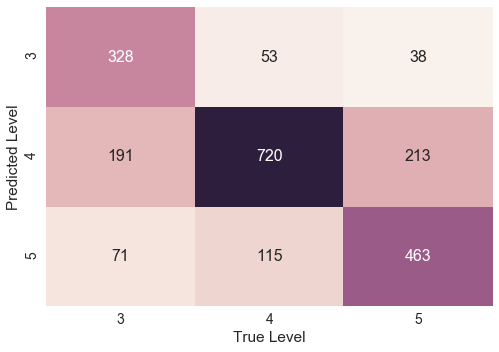

# final_report.md  

## Ben Naismith
## bnaismith@pitt.edu

 
### Table of contents

1. [Project overview](#1-Project-overview)
 
 
2. [Overall history](#2-Overall-history)
 
 
3. [Data](#3-Data)
    - 3.1 [Data description](#3-1-Data-description)
    - 3.2 [Data cleaning](#3-2-Data-cleaning)
    - 3.3 [Data practices](#3-3-Data-practices)
 
 
4. [Analysis](#4-Analysis)
    - 4.1 [Approaches and research questions](#4-1-Approach-and-research-questions)
    - 4.2 [Computational methods and analysis](#4-2-Computational-methods-and-analysis)
    - 4.3 [Findings and discussion](#4-3-Findings-and-discussion)
    - 4.4 [Future research](#4-4-Future-research)
 
    
5. [References](#5-References)

 
### 1. Project overview

At the University of Pittsburgh, a data set was created from the output of learners at the English Language Institute (ELI) from 2005-2012. This output was in response to speaking, writing, reading, and grammar tasks, with the resulting corpus consisting of written and transcribed speaking texts from primarily three different proficiency levels (low-intermediate, intermediate, and advanced). The majority of learners in this corpus have one of three first language: Arabic, Chinese, and Korean.  

__*Figure 1: Number of classes (y axis) per level (x axis) for reading, writing speaking, listening, and grammar*__

    

To date, there has already been analysis of the corpus, e.g. in relation to lexical development (Juffs 2015), yet numerous avenues for research remain. This research project seeks to complement the current work of Juffs (2017) which analyzes lexical bundles in academic writing in the corpus. In this related project, lexical bundles, specifically written bigrams, are collected and analyzed, with a view to investigating the relationship between the metric of Mutual Information (MI), learner proficiency, and bigram frequency.  

MI is the strength of the association between words, i.e. the two-way likelihood of them co-occurring (Simpson-Vlach & Ellis, 2010). MI is of particular importance when considering how meaningful formulaic sequences are, as they are the statistical measure which corresponds most closely to native speaker judgements of the salience of formulaic sequences (Paquot & Granger, 2012).  

 
### 2. Overall history  

The project started in earnest on October 1st and was completed on December 14th, 2017. Initially, the plan was to focus on longer formulaic chunks of learners’ spoken language. However, after significant data exploration, acquiring the speaking transcripts was found to be overly difficult at that time, and as a result, I pivoted my focus to written bigrams.
In the early stages of the project, the majority of my time was spent on familiarizing myself with the data as there were numerous CSV files intertwined in different ways. These efforts far exceeded my initial expectations regarding the amount of work required for this stage. In addition, during this period time was spent on initial cleaning efforts (see [progress_code1_cleaning](early_experiments/project_code1_cleaning.ipynb), and creating project documents like the [license agreement](LICENSE_notes.md) and [README](README.md) file.  

However, once a sanitized version of the data was available (thanks to the [ELI Data Mining Group](https://github.com/ELI-Data-Mining-Group), I was able to create a dataframe with the relevant information, and from there data analysis progressed (relatively) smoothly. As a result, I was able to collect interesting data to address my research questions. Unfortunately, however, the final results did not disprove the null hypothesis and the corresponding machine learning was not a useful predictor of learners’ proficiency. Nevertheless, these struggles in both data cleaning and machine learning have ultimately produced a usable and complex dataset and have prompted numerous avenues for further investigations.  

For a more complete diary of the history of the project, please see the [progress_report.md](progress_report.md).  

 
### 3. Data

#### 3.1 Data description

In its initial format, the data consisted of 20 csv files in a private github repository, with the corresponding original txt and wav files stored on external hard drives at the University of Pittsburgh. These csv files included a mix of smaller ‘index’ files with labelling information, and large files containing all of the questions, answers, teacher information, and student information collected over seven years.

Due to the longitudinal nature of the original data collection, a number of different systems, managed by a number of different people, had been used over the years. As a result, there were often issues in terms of notation consistency for various fields, and the location of different information was not always apparent.

Overall, however, once the data had been ‘wrangled’ into a manageable format, the sub-corpus I was using had the following characteristics (compiled in the level_df dataframe):

[__Figure 2: levels_df table__](Visualizations.md#2-reminder-of-overall-breakdown)

<table border="1" class="dataframe">
  <thead>
    <tr style="text-align: right;">
      <th></th>
      <th>unigram_toks</th>
      <th>unigram_types</th>
      <th>bigram_toks</th>
      <th>bigram_types</th>
      <th>texts</th>
    </tr>
  </thead>
  <tbody>
    <tr>
      <th>Level 3</th>
      <td>282844</td>
      <td>11816</td>
      <td>282843</td>
      <td>81209</td>
      <td>2698</td>
    </tr>
    <tr>
      <th>Level 4</th>
      <td>1193172</td>
      <td>23231</td>
      <td>1193171</td>
      <td>236467</td>
      <td>4509</td>
    </tr>
    <tr>
      <th>Level 5</th>
      <td>1060753</td>
      <td>23667</td>
      <td>1060752</td>
      <td>236637</td>
      <td>3749</td>
    </tr>
    <tr>
      <th>Total</th>
      <td>2549012</td>
      <td>39016</td>
      <td>2549011</td>
      <td>430738</td>
      <td>10956</td>
    </tr>
  </tbody>
</table>

[__Figure 3:  levels_df chart__](Visualizations.md#2-reminder-of-overall-breakdown)
 

From the above figures, we can see that in terms of total tokens, unigram types, and bigram types, there is little difference between levels 4 and 5, which are both significantly higher than level 3. This ratio remains true even when accounting for the relative number of students in each level as 28% of the answers were from level 3, 39% from level 4, and 33% from level 5.
It should be noted that all of these figures (and all subsequent description of data) relate only to a subset of the total texts. Of the total texts, 10,956 met the necessary criteria:
-	written essays (not grammar practice tasks)
-	from levels 3-5
-	minimum of 10 words
-	first versions only (no improved resubmissions)  

[*see here for relevant code which applies these criteria*](project_code_final.md#13-combo-dataframe)

 
#### 3.2 Data cleaning ####

As mentioned earlier, significant data cleaning and sanitization efforts were required prior to commencing data analysis. Some of the steps in this process included:
-	anonymizing data by removing student and teacher names
-	eliminating fake users (typically teachers creating test accounts)
-	normalizing codes, e.g. the names given to languages/dialects
-	transforming NaN, null, and empty strings into the most usable formats
-	transforming data into appropriate types (e.g. strings to integers)
-	improving indices and documentation to describe how the files are linked

While the entire data cleaning code can be found in [progress_code1_cleaning](early_experiments/project_code1_cleaning.ipynb), as a specific example of this type of work, Figure 4 shows code to remove unnecessary apostrophes:

__*Figure 4: removing apostrophes*__

*data1_df['gender'] = [x[1:-1] if type(x) == str and x[0] == "'" else x for x in data1_df['gender']]*

Ultimately, a new sanitized version of all the csv files was created based on these and other data cleaning operations conducted by Dr Na-Rae Han and the members of the [ELI Data Mining Group](https://github.com/ELI-Data-Mining-Group). In addition, the python file [elitools.py](elitools.py) was created which includes useful functions for navigating the data.

 
#### 3.3 Data practices

In all stages of the project, I attempted to follow best practices in terms of techniques for data acquisition, sharing, analysis, and notation. With regard to the data sharing, all files can be found in the public [github repository](https://github.com/Data-Science-for-Linguists/Bigram-analysis-of-writing-from-the-ELI), with a clear table of contents and description of the project in the initial [README](README.md) file.

While the full ELI data set is private at this time, a sample of the 'sanitized' data is included in the 'data' folder. It contains samples of the four CSV files referred to in this code, consisting of 1000 answers, in order to allow for testing and reproducibility by others of the code. The [project code](project_code_final.ipynb) itself is provided in a jupyter notebook which allows for viewers order to see how the code works, with snippets of data from the full dataset displayed throughout. In all of the notebooks, all codes have clear commenting to explain the purpose of each cell.

Careful consideration has also been given to the licensing of the data to ensure that it can be used appropriately in the future. Ultimately, it is the intention of the dataset's authors for the entire dataset to be made public although initially the ELI dataset will remain private as it still contains some personal student information. Once it is ready for publication, a Creative Commons license will be created, a [Attribution-NonCommercial-ShareAlike 3.0 Unported (CC BY-NC-SA 3.0)] (https://creativecommons.org/licenses/by-nc-sa/3.0/legalcode) which allows for sharing and adapting of data. The license for my sample data is the same as the one described above, and full details can be found in the [LICENSE_notes](LICENSE_notes.md) and [LICENSE documents](LICENSE.md).

 
### 4. Analysis

#### 4.1 Approach and research questions

After the initial investigations and pivot to looking at written learner output, two research questions were formulated which I felt could reasonably be answered given the scope of the project:

*1)	Do bigrams with certain MI scores have noticeable, common characteristics?*

*2)	Is MI predictive of learner proficiency?*

From a theoretical perspective, as the research uses computer-derived measures and focuses on meaningful bigrams produced by learners, it can be seen to be grounded in the linguistic theories of Sinclair’s (1991) idiom principle and Hoey’s (2005) lexical priming. Both emphasize semantic aspects of lexical study and see lexis as the central organizing structure for language rather than grammar. On a broader level, the research is rooted in the usage-based perspectives of “[psycholinguistic] and cognitive linguistic theories of language acquisition [which] hold that all linguistic units are abstracted from language use” (Ellis 2002:144).

 
#### 4.2 Computational methods and analysis

In terms of computer-derived measures, I draw on methods from corpus linguistics and second language pedagogy. Whether corpus linguistics itself is a theory is often debated (Gries 2012); here I align with McEnery, Xiao & Tono’s view that “corpus linguistics is a whole system of methods and principles of how to apply corpora in language studies and teaching/learning, it certainly has a theoretical status. Yet theoretical status is not theory in itself” (2006:7f).

To work with the data, I utilized the computer programming language Python, common in computational linguistics and data science. The primary output was two dataframes, one of every text produced by learners (combo_df) and one of every bigram within those texts (bigram_df), with both dataframes accompanied by observed statistics.

Figure 5 shows the first five rows of combo_df in its final form. Here we can see that each row represents a student text and is accompanied by contextual information like the question, student id, level id, and course id. Next, the entire text is represented as a single string, as a list of tokens, and as a list of bigrams. Finally, there are three calculated statistics: the number of bigrams in each text, the sum MI score for all the bigrams, and the average MI of each bigram (click on any figure titles to see the corresponding code).

[__*Figure 5: combo_df*__](project_code_final.md#13-Combo-dataframe)
 

<table border="1" class="dataframe">
  <thead>
    <tr style="text-align: right;">
      <th></th>
      <th>question_id</th>
      <th>user_file_id</th>
      <th>anon_id</th>
      <th>level_id</th>
      <th>course_id</th>
      <th>text</th>
      <th>toks</th>
      <th>bigrams</th>
      <th>bigram_len</th>
      <th>bigrams_lower</th>
      <th>MI_sum</th>
      <th>avg_bigram_MI</th>
    </tr>
    <tr>
      <th>answer_id</th>
      <th></th>
      <th></th>
      <th></th>
      <th></th>
      <th></th>
      <th></th>
      <th></th>
      <th></th>
      <th></th>
      <th></th>
      <th></th>
      <th></th>
    </tr>
  </thead>
  <tbody>
    <tr>
      <th>3</th>
      <td>12</td>
      <td>7507</td>
      <td>dk5</td>
      <td>4</td>
      <td>115</td>
      <td>In my country we usually don't use tea bags. F...</td>
      <td>[In, my, country, we, usually, do, n't, use, t...</td>
      <td>[(In, my), (my, country), (country, we), (we, ...</td>
      <td>67</td>
      <td>[(in, my), (my, country), (country, we), (we, ...</td>
      <td>181.28</td>
      <td>2.71</td>
    </tr>
    <tr>
      <th>5</th>
      <td>12</td>
      <td>7508</td>
      <td>ad1</td>
      <td>4</td>
      <td>115</td>
      <td>First, prepare a port, loose tea, and cup.\r\r...</td>
      <td>[First, ,, prepare, a, port, ,, loose, tea, ,,...</td>
      <td>[(First, ,), (,, prepare), (prepare, a), (a, p...</td>
      <td>73</td>
      <td>[(first, ,), (,, prepare), (prepare, a), (a, p...</td>
      <td>228.84</td>
      <td>3.13</td>
    </tr>
    <tr>
      <th>7</th>
      <td>12</td>
      <td>7509</td>
      <td>eg5</td>
      <td>4</td>
      <td>115</td>
      <td>First, prepare your cup, loose tea or bag tea,...</td>
      <td>[First, ,, prepare, your, cup, ,, loose, tea, ...</td>
      <td>[(First, ,), (,, prepare), (prepare, your), (y...</td>
      <td>49</td>
      <td>[(first, ,), (,, prepare), (prepare, your), (y...</td>
      <td>120.11</td>
      <td>2.45</td>
    </tr>
    <tr>
      <th>8</th>
      <td>13</td>
      <td>7509</td>
      <td>eg5</td>
      <td>4</td>
      <td>115</td>
      <td>I organized the instructions by time, beacause...</td>
      <td>[I, organized, the, instructions, by, time, ,,...</td>
      <td>[(I, organized), (organized, the), (the, instr...</td>
      <td>38</td>
      <td>[(i, organized), (organized, the), (the, instr...</td>
      <td>102.94</td>
      <td>2.71</td>
    </tr>
    <tr>
      <th>11</th>
      <td>12</td>
      <td>7511</td>
      <td>fv6</td>
      <td>4</td>
      <td>115</td>
      <td>To make tea, nothing is easier, even if someti...</td>
      <td>[To, make, tea, ,, nothing, is, easier, ,, eve...</td>
      <td>[(To, make), (make, tea), (tea, ,), (,, nothin...</td>
      <td>98</td>
      <td>[(to, make), (make, tea), (tea, ,), (,, nothin...</td>
      <td>269.31</td>
      <td>2.75</td>
    </tr>
  </tbody>
</table>

To create these columns a combination of techniques was used:

-	First the texts were [tokenized](project_code_final.md#8-Tokenization-of-answers) and converted into [bigrams](project_code_final.md#9-bigrams) to allow for frequency counts and other operations.
-	Frequency counts were converted into [unigram](project_code_final.md#10-corpus-frequency-dictionary) and [bigram](project_code_final.md#11-bigram-frequency-dictionary) frequency dictionaries
-	Next, a [formula for calculating MI](project_code_final.md#12-mutual-information) was developed which allows any two words to be entered and an MI score is outputted.
-	Finally, [combo_df](project_code_final.md#13-combo-dataframe) was created by combining existing data (like the student information) from a number of different dataframes using .join and .drop methods, and list comprehension to add the new stats relating to bigram length and MI.

Figure 6 shows the first five rows of bigram_df in its final form. In this dataframe, each row is one bigram, followed by a number of quantitative statistics. These statistics relate to frequency (number of tokens, tokens per million words, tokens per level) and to MI. The reason for having this number of columns was to be able to clearly see the relationship between (normalized) frequency counts and proficiency level.

[__*Figure 6: bigram_df*__](project_code_final.md#15-bigram_df)
 

<table border="1" class="dataframe">
  <thead>
    <tr style="text-align: right;">
      <th></th>
      <th>bigram</th>
      <th>tokens</th>
      <th>MI</th>
      <th>per_million</th>
      <th>lv3_norm_toks</th>
      <th>lv4_norm_toks</th>
      <th>lv5_norm_toks</th>
      <th>lv3_rel_%</th>
      <th>lv4_rel_%</th>
      <th>lv5_rel_%</th>
      <th>lv3_per_M</th>
      <th>lv4_per_M</th>
      <th>lv5_per_M</th>
    </tr>
  </thead>
  <tbody>
    <tr>
      <th>1</th>
      <td>[in, my]</td>
      <td>2629</td>
      <td>3.13</td>
      <td>1031.38</td>
      <td>687</td>
      <td>1124</td>
      <td>805</td>
      <td>26.28</td>
      <td>42.94</td>
      <td>30.78</td>
      <td>269.52</td>
      <td>440.96</td>
      <td>315.81</td>
    </tr>
    <tr>
      <th>2</th>
      <td>[my, country]</td>
      <td>875</td>
      <td>5.50</td>
      <td>343.27</td>
      <td>249</td>
      <td>321</td>
      <td>298</td>
      <td>28.71</td>
      <td>37.01</td>
      <td>34.29</td>
      <td>97.68</td>
      <td>125.93</td>
      <td>116.91</td>
    </tr>
    <tr>
      <th>3</th>
      <td>[country, we]</td>
      <td>17</td>
      <td>0.36</td>
      <td>6.67</td>
      <td>2</td>
      <td>10</td>
      <td>3</td>
      <td>14.59</td>
      <td>62.77</td>
      <td>22.64</td>
      <td>0.78</td>
      <td>3.92</td>
      <td>1.18</td>
    </tr>
    <tr>
      <th>4</th>
      <td>[we, usually]</td>
      <td>80</td>
      <td>3.41</td>
      <td>31.38</td>
      <td>14</td>
      <td>51</td>
      <td>13</td>
      <td>18.71</td>
      <td>64.68</td>
      <td>16.61</td>
      <td>5.49</td>
      <td>20.01</td>
      <td>5.10</td>
    </tr>
    <tr>
      <th>5</th>
      <td>[usually, do]</td>
      <td>53</td>
      <td>3.07</td>
      <td>20.79</td>
      <td>6</td>
      <td>26</td>
      <td>19</td>
      <td>12.48</td>
      <td>50.67</td>
      <td>36.85</td>
      <td>2.35</td>
      <td>10.20</td>
      <td>7.45</td>
    </tr>
  </tbody>
</table>

To create these columns, new functions were defined and applied to the list of bigrams:
-	[Occurrences per million](project_code_final.md#14-occurrences-per-million) is a common corpus statistic to show normalized frequency counts. The unigram_per_M and bigram_per_M calculate this figure based on the relative frequency of a token in relation to the entire corpus.
-	[Normalized tokens functions](project_code_final.md#creating-normalized-toks-per-level-and-relative-percentage-per-level-columns) are also used to show the relative frequency of tokens from level to level, and was necessary due to the slightly different number of texts produced be each level.

Finally, having created these two dataframes, the final code in the notebook [saves the output as pickle files](project_code_final.md#17-pickling) in order to preserve them for future easy analysis.

 
#### 4.3 Findings and discussion

_Statistics_

The [Visualizations notebook](Visualizations.ipynb) and [md file](Visualizations.md) is where the findings are displayed. Looking at the [‘Top 20’ lists](Visualizations.md#3-top-20-lists), the characteristics of bigrams with different properties start to emerge:

- **Frequency**: Looking purely at frequency counts in Figure 7, the bigrams in this list are all either composed of grammatical ‘stop’ words, e.g. [in, the] or punctuation, e.g. [. , the]. It is these types of bigrams which often populate frequency lists but which have no clear pedagogical value and are not meaningful, memorable units.

__*Figure 7: Top 20 frequency*__
 

<table border="1" class="dataframe">
  <thead>
    <tr style="text-align: right;">
      <th></th>
      <th>bigram</th>
      <th>tokens</th>
      <th>MI</th>
      <th>per_million</th>
      <th>lv3_norm_toks</th>
      <th>lv4_norm_toks</th>
      <th>lv5_norm_toks</th>
      <th>lv3_rel_%</th>
      <th>lv4_rel_%</th>
      <th>lv5_rel_%</th>
      <th>lv3_per_M</th>
      <th>lv4_per_M</th>
      <th>lv5_per_M</th>
    </tr>
  </thead>
  <tbody>
    <tr>
      <th>1</th>
      <td>[in, the]</td>
      <td>11172</td>
      <td>2.38</td>
      <td>4382.88</td>
      <td>2315</td>
      <td>3654</td>
      <td>5153</td>
      <td>20.82%</td>
      <td>32.86%</td>
      <td>46.33%</td>
      <td>908.20</td>
      <td>1433.50</td>
      <td>2021.57</td>
    </tr>
    <tr>
      <th>2</th>
      <td>[., the]</td>
      <td>9865</td>
      <td>0.77</td>
      <td>3870.13</td>
      <td>2103</td>
      <td>3970</td>
      <td>3690</td>
      <td>21.57%</td>
      <td>40.71%</td>
      <td>37.85%</td>
      <td>825.03</td>
      <td>1557.47</td>
      <td>1447.62</td>
    </tr>
    <tr>
      <th>3</th>
      <td>[,, and]</td>
      <td>9818</td>
      <td>1.71</td>
      <td>3851.69</td>
      <td>1969</td>
      <td>4295</td>
      <td>3545</td>
      <td>20.07%</td>
      <td>43.79%</td>
      <td>36.14%</td>
      <td>772.46</td>
      <td>1684.97</td>
      <td>1390.74</td>
    </tr>
    <tr>
      <th>4</th>
      <td>[of, the]</td>
      <td>9054</td>
      <td>2.03</td>
      <td>3551.97</td>
      <td>1675</td>
      <td>3146</td>
      <td>4206</td>
      <td>18.55%</td>
      <td>34.86%</td>
      <td>46.59%</td>
      <td>657.12</td>
      <td>1234.20</td>
      <td>1650.05</td>
    </tr>
    <tr>
      <th>5</th>
      <td>[., in]</td>
      <td>8602</td>
      <td>1.68</td>
      <td>3374.64</td>
      <td>1656</td>
      <td>3325</td>
      <td>3619</td>
      <td>19.27%</td>
      <td>38.67%</td>
      <td>42.09%</td>
      <td>649.66</td>
      <td>1304.43</td>
      <td>1419.77</td>
    </tr>
    <tr>
      <th>6</th>
      <td>[,, i]</td>
      <td>8278</td>
      <td>2.40</td>
      <td>3247.53</td>
      <td>2193</td>
      <td>3222</td>
      <td>2799</td>
      <td>26.70%</td>
      <td>39.23%</td>
      <td>34.08%</td>
      <td>860.33</td>
      <td>1264.02</td>
      <td>1098.07</td>
    </tr>
    <tr>
      <th>7</th>
      <td>[,, the]</td>
      <td>8201</td>
      <td>0.64</td>
      <td>3217.33</td>
      <td>1529</td>
      <td>2854</td>
      <td>3810</td>
      <td>18.66%</td>
      <td>34.83%</td>
      <td>46.49%</td>
      <td>599.84</td>
      <td>1119.65</td>
      <td>1494.70</td>
    </tr>
    <tr>
      <th>8</th>
      <td>[., i]</td>
      <td>7442</td>
      <td>2.11</td>
      <td>2919.56</td>
      <td>2185</td>
      <td>2786</td>
      <td>2271</td>
      <td>30.19%</td>
      <td>38.50%</td>
      <td>31.39%</td>
      <td>857.20</td>
      <td>1092.97</td>
      <td>890.93</td>
    </tr>
    <tr>
      <th>9</th>
      <td>[it, is]</td>
      <td>6772</td>
      <td>4.19</td>
      <td>2656.72</td>
      <td>1395</td>
      <td>2548</td>
      <td>2798</td>
      <td>20.69%</td>
      <td>37.80%</td>
      <td>41.51%</td>
      <td>547.27</td>
      <td>999.60</td>
      <td>1097.68</td>
    </tr>
    <tr>
      <th>10</th>
      <td>[., it]</td>
      <td>5154</td>
      <td>2.11</td>
      <td>2021.96</td>
      <td>1109</td>
      <td>2100</td>
      <td>1933</td>
      <td>21.58%</td>
      <td>40.86%</td>
      <td>37.60%</td>
      <td>435.07</td>
      <td>823.85</td>
      <td>758.33</td>
    </tr>
    <tr>
      <th>11</th>
      <td>[there, are]</td>
      <td>5083</td>
      <td>5.99</td>
      <td>1994.11</td>
      <td>1193</td>
      <td>2092</td>
      <td>1770</td>
      <td>23.60%</td>
      <td>41.39%</td>
      <td>35.01%</td>
      <td>468.02</td>
      <td>820.71</td>
      <td>694.39</td>
    </tr>
    <tr>
      <th>12</th>
      <td>[., for]</td>
      <td>4718</td>
      <td>1.87</td>
      <td>1850.91</td>
      <td>1042</td>
      <td>2014</td>
      <td>1662</td>
      <td>22.10%</td>
      <td>42.70%</td>
      <td>35.22%</td>
      <td>408.79</td>
      <td>790.11</td>
      <td>652.02</td>
    </tr>
    <tr>
      <th>13</th>
      <td>[,, you]</td>
      <td>4668</td>
      <td>2.01</td>
      <td>1831.30</td>
      <td>1127</td>
      <td>2256</td>
      <td>1283</td>
      <td>24.15%</td>
      <td>48.35%</td>
      <td>27.50%</td>
      <td>442.13</td>
      <td>885.05</td>
      <td>503.33</td>
    </tr>
    <tr>
      <th>14</th>
      <td>[to, the]</td>
      <td>4573</td>
      <td>0.60</td>
      <td>1794.03</td>
      <td>868</td>
      <td>1624</td>
      <td>2070</td>
      <td>19.03%</td>
      <td>35.60%</td>
      <td>45.37%</td>
      <td>340.52</td>
      <td>637.11</td>
      <td>812.08</td>
    </tr>
    <tr>
      <th>15</th>
      <td>[is, a]</td>
      <td>4439</td>
      <td>2.48</td>
      <td>1741.46</td>
      <td>1114</td>
      <td>1619</td>
      <td>1678</td>
      <td>25.25%</td>
      <td>36.71%</td>
      <td>38.05%</td>
      <td>437.03</td>
      <td>635.15</td>
      <td>658.29</td>
    </tr>
    <tr>
      <th>16</th>
      <td>[on, the]</td>
      <td>4286</td>
      <td>3.17</td>
      <td>1681.44</td>
      <td>948</td>
      <td>1401</td>
      <td>1932</td>
      <td>22.16%</td>
      <td>32.72%</td>
      <td>45.12%</td>
      <td>371.91</td>
      <td>549.62</td>
      <td>757.94</td>
    </tr>
    <tr>
      <th>17</th>
      <td>[,, it]</td>
      <td>4258</td>
      <td>1.97</td>
      <td>1670.45</td>
      <td>821</td>
      <td>1665</td>
      <td>1770</td>
      <td>19.30%</td>
      <td>39.11%</td>
      <td>41.59%</td>
      <td>322.09</td>
      <td>653.19</td>
      <td>694.39</td>
    </tr>
    <tr>
      <th>18</th>
      <td>[a, lot]</td>
      <td>4192</td>
      <td>5.71</td>
      <td>1644.56</td>
      <td>895</td>
      <td>1969</td>
      <td>1321</td>
      <td>21.39%</td>
      <td>47.04%</td>
      <td>31.57%</td>
      <td>351.12</td>
      <td>772.46</td>
      <td>518.24</td>
    </tr>
    <tr>
      <th>19</th>
      <td>[is, the]</td>
      <td>4006</td>
      <td>1.16</td>
      <td>1571.59</td>
      <td>789</td>
      <td>1605</td>
      <td>1574</td>
      <td>19.89%</td>
      <td>40.44%</td>
      <td>39.67%</td>
      <td>309.53</td>
      <td>629.66</td>
      <td>617.49</td>
    </tr>
    <tr>
      <th>20</th>
      <td>[,, they]</td>
      <td>3793</td>
      <td>2.14</td>
      <td>1488.03</td>
      <td>708</td>
      <td>1656</td>
      <td>1426</td>
      <td>18.68%</td>
      <td>43.69%</td>
      <td>37.63%</td>
      <td>277.75</td>
      <td>649.66</td>
      <td>559.43</td>
    </tr>
  </tbody>
</table>

- **High MI:** In Figure 8, on the other hand, the items with the highest MI scores are listed. Here, the bigrams are clearly meaningful units, but again there is little obvious value to learners in terms of increasing their collocational ability. Items in this list tend to be either proper nouns, e.g. [los, angeles] or compound nouns, e.g. [alarm, clock].

 
__*Figure 8: Top 20 high MI*__
 

<table border="1" class="dataframe">
  <thead>
    <tr style="text-align: right;">
      <th></th>
      <th>bigram</th>
      <th>tokens</th>
      <th>MI</th>
      <th>per_million</th>
      <th>lv3_norm_toks</th>
      <th>lv4_norm_toks</th>
      <th>lv5_norm_toks</th>
      <th>lv3_rel_%</th>
      <th>lv4_rel_%</th>
      <th>lv5_rel_%</th>
      <th>lv3_per_M</th>
      <th>lv4_per_M</th>
      <th>lv5_per_M</th>
    </tr>
  </thead>
  <tbody>
    <tr>
      <th>4949</th>
      <td>[los, angeles]</td>
      <td>34</td>
      <td>15.95</td>
      <td>13.34</td>
      <td>5</td>
      <td>7</td>
      <td>20</td>
      <td>17.53%</td>
      <td>21.59%</td>
      <td>60.88%</td>
      <td>1.96</td>
      <td>2.75</td>
      <td>7.85</td>
    </tr>
    <tr>
      <th>6097</th>
      <td>[hong, kong]</td>
      <td>50</td>
      <td>15.36</td>
      <td>19.62</td>
      <td>10</td>
      <td>38</td>
      <td>1</td>
      <td>20.71%</td>
      <td>76.18%</td>
      <td>3.11%</td>
      <td>3.92</td>
      <td>14.91</td>
      <td>0.39</td>
    </tr>
    <tr>
      <th>6485</th>
      <td>[undergrad, grill]</td>
      <td>45</td>
      <td>15.19</td>
      <td>17.65</td>
      <td>3</td>
      <td>41</td>
      <td>0</td>
      <td>8.71%</td>
      <td>92.18%</td>
      <td>-0.89%</td>
      <td>1.18</td>
      <td>16.08</td>
      <td>0.00</td>
    </tr>
    <tr>
      <th>6987</th>
      <td>[niagara, falls]</td>
      <td>37</td>
      <td>15.00</td>
      <td>14.52</td>
      <td>5</td>
      <td>32</td>
      <td>0</td>
      <td>14.11%</td>
      <td>86.77%</td>
      <td>-0.89%</td>
      <td>1.96</td>
      <td>12.55</td>
      <td>0.00</td>
    </tr>
    <tr>
      <th>6988</th>
      <td>[el, nino]</td>
      <td>60</td>
      <td>15.00</td>
      <td>23.54</td>
      <td>5</td>
      <td>-4</td>
      <td>59</td>
      <td>8.71%</td>
      <td>-7.82%</td>
      <td>99.11%</td>
      <td>1.96</td>
      <td>-1.57</td>
      <td>23.15</td>
    </tr>
    <tr>
      <th>7072</th>
      <td>[san, francisco]</td>
      <td>45</td>
      <td>14.96</td>
      <td>17.65</td>
      <td>3</td>
      <td>24</td>
      <td>16</td>
      <td>8.71%</td>
      <td>54.40%</td>
      <td>36.89%</td>
      <td>1.18</td>
      <td>9.42</td>
      <td>6.28</td>
    </tr>
    <tr>
      <th>7437</th>
      <td>[carbon, dioxide]</td>
      <td>61</td>
      <td>14.82</td>
      <td>23.93</td>
      <td>7</td>
      <td>5</td>
      <td>46</td>
      <td>12.10%</td>
      <td>9.13%</td>
      <td>78.78%</td>
      <td>2.75</td>
      <td>1.96</td>
      <td>18.05</td>
    </tr>
    <tr>
      <th>9741</th>
      <td>[southwestern, pennsylvania]</td>
      <td>33</td>
      <td>14.04</td>
      <td>12.95</td>
      <td>15</td>
      <td>-1</td>
      <td>0</td>
      <td>108.71%</td>
      <td>-7.82%</td>
      <td>-0.89%</td>
      <td>5.88</td>
      <td>-0.39</td>
      <td>0.00</td>
    </tr>
    <tr>
      <th>9747</th>
      <td>[frying, pan]</td>
      <td>49</td>
      <td>14.04</td>
      <td>19.22</td>
      <td>52</td>
      <td>-2</td>
      <td>0</td>
      <td>106.67%</td>
      <td>-5.78%</td>
      <td>-0.89%</td>
      <td>20.40</td>
      <td>-0.78</td>
      <td>0.00</td>
    </tr>
    <tr>
      <th>10794</th>
      <td>[alarm, clock]</td>
      <td>47</td>
      <td>13.73</td>
      <td>18.44</td>
      <td>41</td>
      <td>-1</td>
      <td>7</td>
      <td>87.43%</td>
      <td>-3.57%</td>
      <td>16.14%</td>
      <td>16.08</td>
      <td>-0.39</td>
      <td>2.75</td>
    </tr>
    <tr>
      <th>11627</th>
      <td>[scrambled, eggs]</td>
      <td>60</td>
      <td>13.53</td>
      <td>23.54</td>
      <td>65</td>
      <td>-4</td>
      <td>0</td>
      <td>108.71%</td>
      <td>-7.82%</td>
      <td>-0.89%</td>
      <td>25.50</td>
      <td>-1.57</td>
      <td>0.00</td>
    </tr>
    <tr>
      <th>12110</th>
      <td>[gm, crops]</td>
      <td>92</td>
      <td>13.41</td>
      <td>36.09</td>
      <td>8</td>
      <td>-7</td>
      <td>91</td>
      <td>8.71%</td>
      <td>-7.82%</td>
      <td>99.11%</td>
      <td>3.14</td>
      <td>-2.75</td>
      <td>35.70</td>
    </tr>
    <tr>
      <th>12447</th>
      <td>[falling, asleep]</td>
      <td>30</td>
      <td>13.34</td>
      <td>11.77</td>
      <td>2</td>
      <td>16</td>
      <td>10</td>
      <td>8.71%</td>
      <td>55.51%</td>
      <td>35.78%</td>
      <td>0.78</td>
      <td>6.28</td>
      <td>3.92</td>
    </tr>
    <tr>
      <th>12983</th>
      <td>[jim, springer]</td>
      <td>36</td>
      <td>13.22</td>
      <td>14.12</td>
      <td>3</td>
      <td>33</td>
      <td>0</td>
      <td>8.71%</td>
      <td>92.18%</td>
      <td>-0.89%</td>
      <td>1.18</td>
      <td>12.95</td>
      <td>0.00</td>
    </tr>
    <tr>
      <th>13057</th>
      <td>[ice, cream]</td>
      <td>50</td>
      <td>13.20</td>
      <td>19.62</td>
      <td>34</td>
      <td>14</td>
      <td>1</td>
      <td>68.71%</td>
      <td>28.18%</td>
      <td>3.11%</td>
      <td>13.34</td>
      <td>5.49</td>
      <td>0.39</td>
    </tr>
    <tr>
      <th>13080</th>
      <td>[jim, lewis]</td>
      <td>36</td>
      <td>13.20</td>
      <td>14.12</td>
      <td>3</td>
      <td>33</td>
      <td>0</td>
      <td>8.71%</td>
      <td>92.18%</td>
      <td>-0.89%</td>
      <td>1.18</td>
      <td>12.95</td>
      <td>0.00</td>
    </tr>
    <tr>
      <th>13260</th>
      <td>[traffic, jam]</td>
      <td>36</td>
      <td>13.17</td>
      <td>14.12</td>
      <td>10</td>
      <td>15</td>
      <td>10</td>
      <td>28.15%</td>
      <td>42.18%</td>
      <td>29.67%</td>
      <td>3.92</td>
      <td>5.88</td>
      <td>3.92</td>
    </tr>
    <tr>
      <th>13423</th>
      <td>[mp3, file]</td>
      <td>38</td>
      <td>13.12</td>
      <td>14.91</td>
      <td>3</td>
      <td>-2</td>
      <td>37</td>
      <td>8.71%</td>
      <td>-7.82%</td>
      <td>99.11%</td>
      <td>1.18</td>
      <td>-0.78</td>
      <td>14.52</td>
    </tr>
    <tr>
      <th>14123</th>
      <td>[credit, cards]</td>
      <td>66</td>
      <td>12.99</td>
      <td>25.89</td>
      <td>5</td>
      <td>0</td>
      <td>59</td>
      <td>8.71%</td>
      <td>1.27%</td>
      <td>90.02%</td>
      <td>1.96</td>
      <td>0.00</td>
      <td>23.15</td>
    </tr>
    <tr>
      <th>14423</th>
      <td>[opposing, argument]</td>
      <td>32</td>
      <td>12.92</td>
      <td>12.55</td>
      <td>2</td>
      <td>-2</td>
      <td>31</td>
      <td>8.71%</td>
      <td>-7.82%</td>
      <td>99.11%</td>
      <td>0.78</td>
      <td>-0.78</td>
      <td>12.16</td>
    </tr>
  </tbody>
</table>

- **Medium-high MI:** The following table is again looking at MI, but with a maximum of 10, i.e. a quite high level still, but not extreme. In this case, we start to see some phrasal verbs, e.g. [figure, out] and verb+noun collocations, e.g. [watching, tv]. Although not precise, it seems that perhaps some range of MI around this figure highlights more meaningful collocations that learners are producing.

 
__*Figure 9: Top 20 medium-high MI*__
 

<table border="1" class="dataframe">
  <thead>
    <tr style="text-align: right;">
      <th></th>
      <th>bigram</th>
      <th>tokens</th>
      <th>MI</th>
      <th>per_million</th>
      <th>lv3_norm_toks</th>
      <th>lv4_norm_toks</th>
      <th>lv5_norm_toks</th>
      <th>lv3_rel_%</th>
      <th>lv4_rel_%</th>
      <th>lv5_rel_%</th>
      <th>lv3_per_M</th>
      <th>lv4_per_M</th>
      <th>lv5_per_M</th>
    </tr>
  </thead>
  <tbody>
    <tr>
      <th>36882</th>
      <td>[unemployment, rate]</td>
      <td>36</td>
      <td>9.99</td>
      <td>14.12</td>
      <td>3</td>
      <td>21</td>
      <td>11</td>
      <td>8.71%</td>
      <td>58.84%</td>
      <td>32.45%</td>
      <td>1.18</td>
      <td>8.24</td>
      <td>4.32</td>
    </tr>
    <tr>
      <th>37302</th>
      <td>[south, korea]</td>
      <td>196</td>
      <td>9.95</td>
      <td>76.89</td>
      <td>20</td>
      <td>28</td>
      <td>145</td>
      <td>10.76%</td>
      <td>14.74%</td>
      <td>74.50%</td>
      <td>7.85</td>
      <td>10.98</td>
      <td>56.88</td>
    </tr>
    <tr>
      <th>38085</th>
      <td>[physical, activity]</td>
      <td>93</td>
      <td>9.90</td>
      <td>36.48</td>
      <td>10</td>
      <td>54</td>
      <td>28</td>
      <td>10.86%</td>
      <td>58.84%</td>
      <td>30.30%</td>
      <td>3.92</td>
      <td>21.18</td>
      <td>10.98</td>
    </tr>
    <tr>
      <th>38232</th>
      <td>[tea, bowl]</td>
      <td>52</td>
      <td>9.88</td>
      <td>20.40</td>
      <td>4</td>
      <td>47</td>
      <td>0</td>
      <td>8.71%</td>
      <td>92.18%</td>
      <td>-0.89%</td>
      <td>1.57</td>
      <td>18.44</td>
      <td>0.00</td>
    </tr>
    <tr>
      <th>38265</th>
      <td>[pay, attention]</td>
      <td>117</td>
      <td>9.88</td>
      <td>45.90</td>
      <td>23</td>
      <td>55</td>
      <td>37</td>
      <td>19.82%</td>
      <td>47.73%</td>
      <td>32.45%</td>
      <td>9.02</td>
      <td>21.58</td>
      <td>14.52</td>
    </tr>
    <tr>
      <th>38279</th>
      <td>[eating, habits]</td>
      <td>147</td>
      <td>9.88</td>
      <td>57.67</td>
      <td>12</td>
      <td>97</td>
      <td>36</td>
      <td>8.71%</td>
      <td>66.33%</td>
      <td>24.96%</td>
      <td>4.71</td>
      <td>38.05</td>
      <td>14.12</td>
    </tr>
    <tr>
      <th>38436</th>
      <td>[years, ago]</td>
      <td>420</td>
      <td>9.86</td>
      <td>164.77</td>
      <td>72</td>
      <td>123</td>
      <td>222</td>
      <td>17.32%</td>
      <td>29.50%</td>
      <td>53.18%</td>
      <td>28.25</td>
      <td>48.25</td>
      <td>87.09</td>
    </tr>
    <tr>
      <th>38914</th>
      <td>[public, transportation]</td>
      <td>201</td>
      <td>9.82</td>
      <td>78.85</td>
      <td>42</td>
      <td>49</td>
      <td>109</td>
      <td>21.15%</td>
      <td>24.52%</td>
      <td>54.34%</td>
      <td>16.48</td>
      <td>19.22</td>
      <td>42.76</td>
    </tr>
    <tr>
      <th>39100</th>
      <td>[wake, up]</td>
      <td>113</td>
      <td>9.79</td>
      <td>44.33</td>
      <td>35</td>
      <td>44</td>
      <td>32</td>
      <td>31.72%</td>
      <td>39.08%</td>
      <td>29.20%</td>
      <td>13.73</td>
      <td>17.26</td>
      <td>12.55</td>
    </tr>
    <tr>
      <th>39145</th>
      <td>[chinese, calendar]</td>
      <td>37</td>
      <td>9.79</td>
      <td>14.52</td>
      <td>3</td>
      <td>34</td>
      <td>0</td>
      <td>8.71%</td>
      <td>92.18%</td>
      <td>-0.89%</td>
      <td>1.18</td>
      <td>13.34</td>
      <td>0.00</td>
    </tr>
    <tr>
      <th>39334</th>
      <td>[hang, out]</td>
      <td>69</td>
      <td>9.77</td>
      <td>27.07</td>
      <td>14</td>
      <td>39</td>
      <td>15</td>
      <td>20.30%</td>
      <td>57.40%</td>
      <td>22.30%</td>
      <td>5.49</td>
      <td>15.30</td>
      <td>5.88</td>
    </tr>
    <tr>
      <th>39459</th>
      <td>[college, entrance]</td>
      <td>30</td>
      <td>9.76</td>
      <td>11.77</td>
      <td>2</td>
      <td>20</td>
      <td>6</td>
      <td>8.71%</td>
      <td>68.84%</td>
      <td>22.45%</td>
      <td>0.78</td>
      <td>7.85</td>
      <td>2.35</td>
    </tr>
    <tr>
      <th>39524</th>
      <td>[woke, up]</td>
      <td>39</td>
      <td>9.75</td>
      <td>15.30</td>
      <td>11</td>
      <td>11</td>
      <td>15</td>
      <td>29.22%</td>
      <td>30.64%</td>
      <td>40.14%</td>
      <td>4.32</td>
      <td>4.32</td>
      <td>5.88</td>
    </tr>
    <tr>
      <th>40163</th>
      <td>[figure, out]</td>
      <td>100</td>
      <td>9.71</td>
      <td>39.23</td>
      <td>11</td>
      <td>49</td>
      <td>39</td>
      <td>11.71%</td>
      <td>49.18%</td>
      <td>39.11%</td>
      <td>4.32</td>
      <td>19.22</td>
      <td>15.30</td>
    </tr>
    <tr>
      <th>40166</th>
      <td>[*, &amp;]</td>
      <td>74</td>
      <td>9.71</td>
      <td>29.03</td>
      <td>6</td>
      <td>68</td>
      <td>0</td>
      <td>8.71%</td>
      <td>92.18%</td>
      <td>-0.89%</td>
      <td>2.35</td>
      <td>26.68</td>
      <td>0.00</td>
    </tr>
    <tr>
      <th>40274</th>
      <td>[sex, marriage]</td>
      <td>33</td>
      <td>9.70</td>
      <td>12.95</td>
      <td>2</td>
      <td>-2</td>
      <td>32</td>
      <td>8.71%</td>
      <td>-7.82%</td>
      <td>99.11%</td>
      <td>0.78</td>
      <td>-0.78</td>
      <td>12.55</td>
    </tr>
    <tr>
      <th>40547</th>
      <td>[10, percent]</td>
      <td>31</td>
      <td>9.67</td>
      <td>12.16</td>
      <td>23</td>
      <td>4</td>
      <td>2</td>
      <td>76.45%</td>
      <td>14.76%</td>
      <td>8.79%</td>
      <td>9.02</td>
      <td>1.57</td>
      <td>0.78</td>
    </tr>
    <tr>
      <th>40634</th>
      <td>[20, minutes]</td>
      <td>32</td>
      <td>9.67</td>
      <td>12.55</td>
      <td>7</td>
      <td>8</td>
      <td>15</td>
      <td>24.33%</td>
      <td>26.55%</td>
      <td>49.11%</td>
      <td>2.75</td>
      <td>3.14</td>
      <td>5.88</td>
    </tr>
    <tr>
      <th>40662</th>
      <td>[taking, notes]</td>
      <td>30</td>
      <td>9.66</td>
      <td>11.77</td>
      <td>19</td>
      <td>8</td>
      <td>1</td>
      <td>65.37%</td>
      <td>28.84%</td>
      <td>5.78%</td>
      <td>7.45</td>
      <td>3.14</td>
      <td>0.39</td>
    </tr>
    <tr>
      <th>40828</th>
      <td>[watching, tv]</td>
      <td>116</td>
      <td>9.64</td>
      <td>45.51</td>
      <td>21</td>
      <td>51</td>
      <td>42</td>
      <td>18.19%</td>
      <td>44.76%</td>
      <td>37.05%</td>
      <td>8.24</td>
      <td>20.01</td>
      <td>16.48</td>
    </tr>
  </tbody>
</table>

Other lists are all included in the Visualizations notebook and are related to frequency counts across levels. However, these lists do not reveal any tendencies other than indicating what prompts the learners at each level were answering.

[_Machine learning_](Visualizations.md#4-machine-learning)  

Two types of machine learning were employed to predict learners’ proficiency level. The first of these utilized a Naïve Bayes classifier to predict level based on the likelihood of the words in the answer appearing at each level. This option was selected as a type of control group as similar methods have yielded positive results on other similar corpora like the ETS exam corpus.

From the resulting heat map (Figure 10), the dark diagonal line indicates that the correct level was predicted more often than not, although some level 5 texts were predicted to be level 4. This error is unsurprising as we saw in the overall statistics that level 4 and 5 students share many characteristics. Overall, this model had a 69% accuracy rate in predicting the levels of the test dataset (20% of the total texts).

 
__*Figure 10: Heatmap of predicted student level vs actual student level*__

  

The second model used is a linear regression utilizing the level and the average bigram length in a text. Originally, it was though that perhaps higher levels would have higher average MI scores, but this was not the case. If this had been true, we would expect to see a step-like shape in Figure 11, whereas here we see that the average MI score is basically identical for each level. This may be due to an equal proportional increase in meaningful collocations as well as grammatical words as level increases, but further investigations would need to be conducted to check this hypothesis.

 
__*Figure 11: Linear regression of student level and average bigram usage (blue line is expected level)*__

  

 
#### 4.4 Future research

Based on the answers to the initial research questions, there are a number avenues of related research which seem promising. Most importantly, it is necessary to look at the current findings from the learner corpus in relation to findings from more general corpora. For example, it would be revealing of learners’ lexis to see how the MI of bigrams in their corpus compares to those of COCA or other large general corpora.

A second line of inquiry would be to further combine computational linguistics with research into human perceptions of formulaic language. For example, teachers could be asked to rate the usefulness of different lists of bigrams from the corpus, with a view to determining which characteristics correlate with the teachers’ perceptions. By comparing the original data to subjective ratings, such research would follow Ellis & Simpson-Vlach (2010) and Jarvis (2013) who compare statistical lexical data with expert judgments.

Finally, significant research remains to be completed from a computational standpoint as other factors like learners’ first languages or the differences between the written and spoken texts were beyond the scope of my initial project.

 
### 5. References

**Ellis, N. C.** (2002). Frequency effects and language processing: a review with implications for theories of implicit and explicit language acquisition. Studies in Second Language Acquisition, 24:143-188. doi: 10.1017.S0272263102002024

**Gries, S. (2012)**. Corpus linguistics, theoretical linguistics, and cognitive/psycholinguistics: Towards more and more fruitful exchanges. Corpus Linguistics and Variation in English. 41-63. doi: 10.1163/9789401207713_006

**Hoey, M.** (2005). Lexical Priming: A New Theory of Words and Language. London: Routledge.

**Jarvis, S.** (2013). Capturing the Diversity in Lexical Diversity. Language Learning, 63:87–106. doi:10.1111/j.1467-9922.2012.00739.x

**Juffs, A.** (Forthcoming). Lexical Development In The Writing Of Intensive English Program Students. In R.M. DeKeyser & G. Preito Botana (Eds.), Reconciling methodological demands with pedagogic applicability. Amsterdam: John Benjamins.

**McEnery, T., R. Xiao & Y. Tono.** (2006). Corpus-based Language Studies: An Advanced Resource Book. London: Routledge.

**Juffs, A. 2017.** The longitudinal development of lexical bundles in the written output of Arabic-speaking ESL learners. Unpublished manuscript.  

**Paquot, M., & Granger, S.** (2012). Formulaic language in learner corpora. Annual Review of Applied Linguistics, 32: 130-149. doi:10.1017/S0267190512000098

**Simpson-Vlach, R. & N.C. Ellis.** (2010). An Academic Formulas List: New Methods in Phraseology Research. Applied Linguistics, 31(4): 487–512. doi:10.1093/applin/amp058

**Sinclair, J. (1991).** Corpus, concordance, collocation. Oxford: Oxford University Press.
